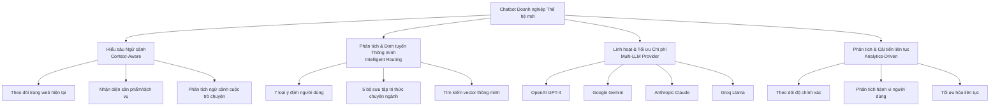
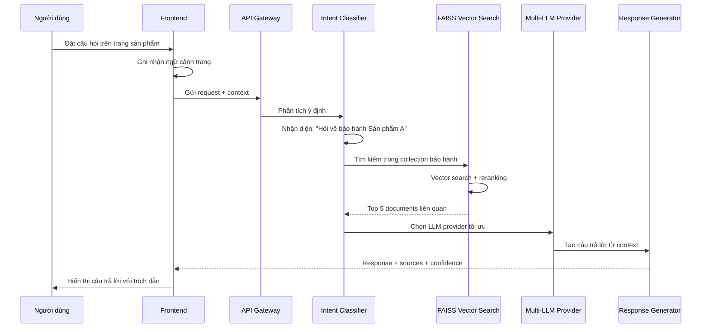
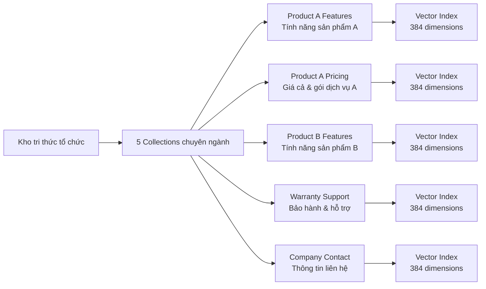
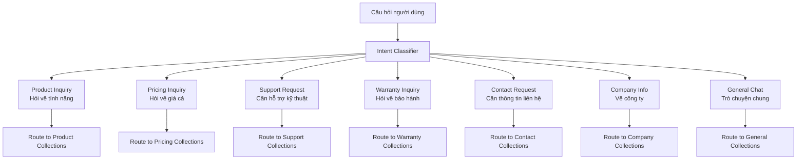
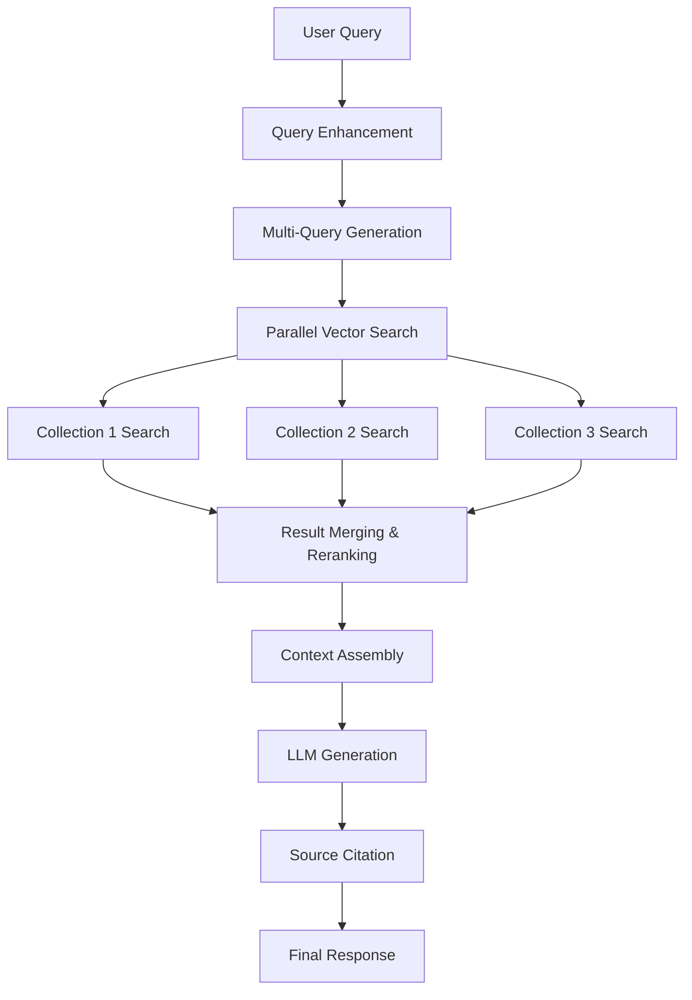
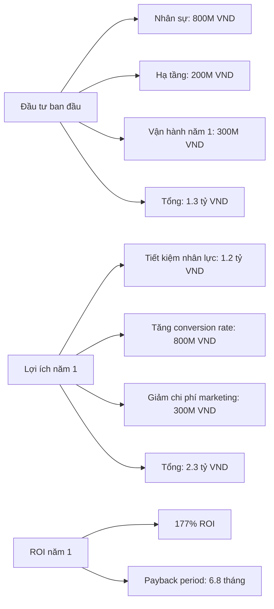
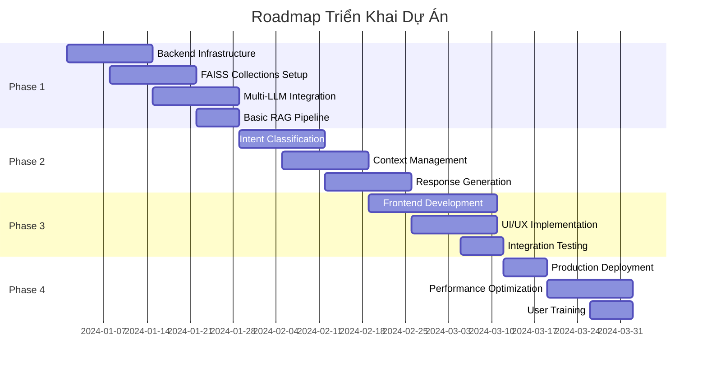
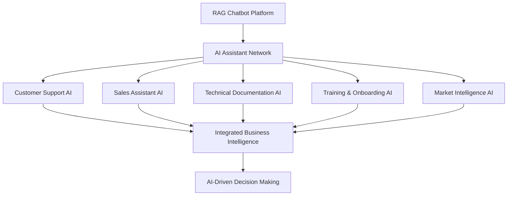

# BÁO CÁO DỰ ÁN: XÂY DỰNG HỆ THỐNG CHATBOT DOANH NGHIỆP THẾ HỆ MỚI
**Công ty TNHH Kỹ thuật Quản lý bay**

---

## THÔNG TIN DỰ ÁN

**Người trình bày:** Tổng Công trình sư  
**Đối tượng:** Hội đồng Khoa học Công nghệ  
**Ngày trình bày:** [Ngày hiện tại]  
**Thời gian dự kiến:** 45 phút  

---

## I. TỔNG QUAN VÀ BỐI CẢNH DOANH NGHIỆP

### 1.1 Lịch sử phát triển công ty

Công ty TNHH Kỹ thuật Quản lý bay có hành trình phát triển 38 năm từ 1986 đến nay:

- **1986**: Khởi đầu với Xí nghiệp Điện tử hàng không phục vụ ngành Hàng không dân dụng Việt Nam
- **1989**: Thành lập Trung tâm Thông tin Hàng không - định hướng chuyên sâu về thông tin điện tử
- **1998-2008**: Giai đoạn chuyển đổi và mở rộng dịch vụ kỹ thuật chuyên ngành
- **2010**: Chuyển đổi thành Công ty TNHH với tư cách pháp nhân độc lập

### 1.2 Thách thức hiện tại trong kỷ nguyên số

Với 38 năm kinh nghiệm, chúng ta đã tích lũy một kho tri thức khổng lồ về:
- Công nghệ hàng không và quản lý bay
- Hệ thống thông tin điện tử chuyên ngành  
- Quy trình vận hành và bảo trì thiết bị
- Tiêu chuẩn an toàn hàng không quốc tế

**Vấn đề cốt lõi:** Làm thế nào để số hóa và tận dụng hiệu quả kho tri thức này trong thời đại AI?

---

## II. TỔNG QUAN GIẢI PHÁP ĐỀ XUẤT

### 2.1 Tầm nhìn chiến lược

Xây dựng hệ thống Chatbot Doanh nghiệp thế hệ mới sử dụng công nghệ **Retrieval-Augmented Generation (RAG)** - không chỉ là một công cụ hỗ trợ mà là "Bộ não số" tập trung toàn bộ tri thức của tổ chức.

### 2.2 Bốn trụ cột công nghệ chính

---

## III. KIẾN TRÚC CÔNG NGHỆ CHI TIẾT

### 3.1 Sơ đồ tổng quan hệ thống

### 3.2 Luồng xử lý thông minh

### 3.3 Cấu trúc dữ liệu tri thức

---

## IV. CÁC TÍNH NĂNG VƯỢT TRỘI

### 4.1 Context-Aware Intelligence

**Vấn đề truyền thống:** Chatbot không biết người dùng đang ở đâu trên website, xem sản phẩm nào.

**Giải pháp của chúng tôi:**
- Theo dõi realtime URL, tiêu đề trang, section hiện tại
- Tự động nhận diện sản phẩm từ đường dẫn
- Ưu tiên thông tin liên quan đến ngữ cảnh hiện tại

**Ví dụ thực tế:** Khi khách hàng hỏi "Giá bao nhiêu?" trên trang Product A, hệ thống tự động hiểu là hỏi về giá Product A, không cần làm rõ thêm.

### 4.2 Intelligent Intent Classification

### 4.3 Multi-LLM Provider Resilience

**Thách thức:** Phụ thuộc vào một nhà cung cấp AI duy nhất rủi ro cao về chi phí và độ tin cậy.

**Giải pháp:**
- Tích hợp 4 nhà cung cấp: OpenAI, Google, Groq, OpenRouter
- Automatic failover khi một provider gặp sự cố
- Lựa chọn provider tối ưu dựa trên độ trễ và chi phí
- Load balancing thông minh

**Lợi ích:**
- Giảm 40-60% chi phí so với dùng OpenAI độc quyền
- Đảm bảo uptime 99.9%
- Tối ưu tốc độ phản hồi

### 4.4 Advanced RAG với Vector Search

---

## V. PHÂN TÍCH LỢI ÍCH KINH DOANH

### 5.1 Tác động trực tiếp

**Tăng hiệu suất vận hành:**
- Tự động hóa 80% câu hỏi lặp đi lặp lại
- Giảm thời gian phản hồi từ 24 giờ xuống 30 giây
- Đội ngũ support tập trung vào vấn đề phức tạp, giá trị cao

**Nâng cao trải nghiệm khách hàng:**
- Hỗ trợ 24/7 không nghỉ
- Câu trả lời nhất quán, chính xác với trích dẫn nguồn
- Hỗ trợ đa ngữ cảnh thông minh

### 5.2 Tác động chiến lược

**Khai phá dữ liệu vàng:**
- Phân tích hàng nghìn câu hỏi của khách hàng
- Nhận diện xu hướng và nhu cầu mới
- Cải thiện sản phẩm dựa trên insight thực tế

**Xây dựng lợi thế cạnh tranh:**
- Trở thành công ty đầu tiên trong ngành áp dụng RAG
- Tạo rào cản công nghệ cao với đối thủ
- Nền tảng mở rộng sang các sản phẩm AI khác

### 5.3 Phân tích ROI dự kiến

---

## VI. ROADMAP TRIỂN KHAI

### 6.1 Giai đoạn 1: Foundation (Tuần 1-4)

### 6.2 Nguồn lực cần thiết

**Đội ngũ nòng cốt:**
- 1 Project Manager/Tech Lead
- 2 Senior Backend Developers (Python/FastAPI)
- 1 Senior Frontend Developer (React/TypeScript)  
- 1 DevOps Engineer
- 1 Data Scientist/ML Engineer

**Hạ tầng công nghệ:**
- Server GPU RTX 3060 24GB (sẵn có)
- Cloud hosting cho production
- Các API keys cho LLM providers

### 6.3 Ngân sách chi tiết

| Hạng mục | Chi phí (VND) | Ghi chú |
|----------|---------------|---------|
| Nhân sự (8 tháng) | 800,000,000 | Team 5 người |
| Hạ tầng cloud | 120,000,000 | AWS/Azure năm đầu |
| API costs (LLM) | 80,000,000 | Multi-provider |
| Software licenses | 50,000,000 | Tools và frameworks |
| Contingency (10%) | 105,000,000 | Rủi ro và phát sinh |
| **Tổng cộng** | **1,155,000,000** | **~1.16 tỷ VND** |

---

## VII. QUẢN LÝ RỦI RO VÀ GIẢM THIỂU

### 7.1 Rủi ro công nghệ

**Rủi ro:** Các API LLM có thể thay đổi giá hoặc ngừng hoạt động.
**Giải pháp:** Multi-provider architecture với automatic failover.

**Rủi ro:** Chất lượng câu trả lời không đạt yêu cầu.
**Giải pháp:** 
- Continuous learning từ feedback
- A/B testing với các prompt templates
- Human-in-the-loop validation

### 7.2 Rủi ro dữ liệu

**Rủi ro:** Dữ liệu nhạy cảm bị lộ qua API.
**Giải pháp:**
- Data anonymization trước khi gửi API
- On-premise deployment option
- Encrypted data transmission

### 7.3 Rủi ro dự án

**Rủi ro:** Delay do phụ thuộc third-party APIs.
**Giải pháp:** 
- Parallel development tracks
- Early integration testing
- Fallback to simpler solutions if needed

---

## VIII. KẾ HOẠCH MỞ RỘNG TƯƠNG LAI

### 8.1 Giai đoạn 2: Enhanced Intelligence

- **Multimodal Support:** Xử lý hình ảnh, PDF, video
- **Advanced Analytics:** Predictive insights từ conversation data  
- **Personalization:** Cá nhân hóa theo từng nhóm khách hàng

### 8.2 Giai đoạn 3: Ecosystem Integration

- **CRM Integration:** Kết nối với hệ thống quản lý khách hàng
- **API Marketplace:** Cung cấp AI services cho đối tác
- **Mobile Applications:** Native mobile apps

### 8.3 Vision 2027: AI-First Organization

---

## IX. KẾT LUẬN VÀ KHUYẾN NGHỊ

### 9.1 Tại sao phải làm ngay?

1. **Cơ hội chiến lược:** Trở thành pioneer trong ngành về RAG technology
2. **Lợi thế cạnh tranh:** Tạo rào cản công nghệ cao với đối thủ  
3. **ROI hấp dẫn:** 177% ROI năm đầu, payback 6.8 tháng
4. **Foundation platform:** Nền tảng cho các sản phẩm AI tương lai

### 9.2 Yếu tố then chốt thành công

- **Leadership commitment:** Sự ủng hộ mạnh mẽ từ ban lãnh đạo
- **Cross-functional collaboration:** Phối hợp chặt chẽ giữa các bộ phận
- **Continuous learning:** Mindset học hỏi và thích ứng nhanh
- **Customer-centric approach:** Luôn đặt trải nghiệm khách hàng làm trung tâm

### 9.3 Đề xuất quyết định

**Phê duyệt ngay:**
- Ngân sách 1.16 tỷ VND cho giai đoạn 1
- Team 5 người chuyên trách trong 8 tháng
- Bắt đầu triển khai từ tuần tới

**Milestone đánh giá:**
- Tháng 2: Demo MVP với basic RAG
- Tháng 4: Beta version với đầy đủ features  
- Tháng 6: Production launch
- Tháng 8: Full evaluation và planning phase 2

---

**Cảm ơn Hội đồng Khoa học Công nghệ đã lắng nghe. Chúng tôi sẵn sàng trả lời các câu hỏi và thảo luận chi tiết về từng khía cạnh của dự án này.**

---

*"Không phải AI sẽ thay thế con người, mà những người biết sử dụng AI sẽ thay thế những người không biết. Hãy để công ty chúng ta dẫn đầu cuộc cách mạng này."*
