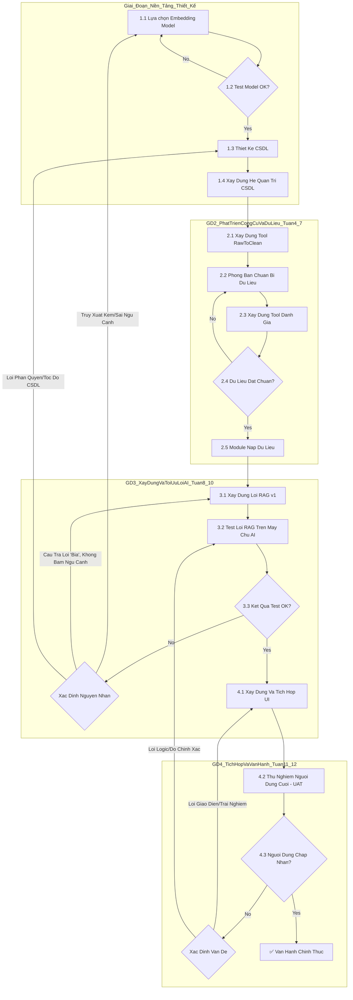

Biểu đồ luồng công việc với các "vòng lặp" (feedback loops) để xử lý khi có lỗi. Quy trình làm việc sẽ linh hoạt, lường trước rủi ro và tập trung vào chất lượng.

Dưới đây là biểu đồ và diễn giải chi tiết.

-----

### **4. Biểu đồ Luồng công việc & Xử lý Rủi ro**

Biểu đồ dưới đây mô tả luồng công việc chi tiết của dự án, bao gồm các "chốt chặn chất lượng" (Quality Gates) và các vòng lặp xử lý khi một công đoạn không đạt yêu cầu.

#### **Diễn giải Biểu đồ và các Vòng lặp Xử lý:**

Biểu đồ này thể hiện một quy trình kiểm soát chất lượng liên tục. Nếu một bước thất bại, thay vì đi tiếp, luồng công việc sẽ quay lại bước phù hợp để khắc phục.

1.  **Vòng lặp tại Giai đoạn 1 (Lựa chọn Model):**

      * **Nếu `[A2] Test Model OK?` trả về "No"**: Điều này có nghĩa là các embedding model được chọn không hiệu quả với dữ liệu đặc thù của công ty.
      * **Hành động:** Quay lại bước `[A1]`, chúng ta phải tìm kiếm, thử nghiệm các model khác hoặc xem xét phương án tinh chỉnh (fine-tuning) model. Đây là vòng lặp nền tảng để đảm bảo "trái tim" của việc tìm kiếm hoạt động tốt.

2.  **Vòng lặp tại Giai đoạn 2 (Chuẩn bị Dữ liệu):**

      * **Nếu `[D2] Dữ liệu đạt chuẩn?` trả về "No"**: Đây là vòng lặp phổ biến nhất. Tool đánh giá phát hiện dữ liệu do phòng ban cung cấp bị trùng lặp, mâu thuẫn hoặc sai định dạng.
      * **Hành động:** Hệ thống sẽ gửi trả lại tài liệu lỗi cho `[C2] Phòng ban`, yêu cầu họ sử dụng `[C1] Tool Raw-->Clean` để chỉnh sửa lại. Vòng lặp này đảm bảo chỉ "dữ liệu vàng" mới được đưa vào hệ thống.

3.  **Vòng lặp tại Giai đoạn 3 (Tối ưu Lõi AI):**

      * **Đây là vòng lặp phức tạp và quan trọng nhất.** Nếu `[F3] Kết quả Test Lõi RAG OK?` trả về "No", chúng ta phải xác định rõ nguyên nhân gốc rễ:
          * **Nếu "Truy xuất kém/Sai ngữ cảnh"**: Vấn đề nằm ở khả năng "tìm" của hệ thống.
              * **Hành động:** Quay lại tận bước `[A1] Lựa chọn Embedding Model`. Đây là một thay đổi lớn, cho thấy model ban đầu không phù hợp như chúng ta nghĩ.
          * **Nếu "Câu trả lời 'bịa', không bám ngữ cảnh"**: Vấn đề nằm ở khả năng "tổng hợp" của LLM.
              * **Hành động:** Quay lại bước `[F1] Xây dựng Lõi RAG` để tinh chỉnh lại Prompt Engineering (cách chúng ta "ra lệnh" cho LLM).
          * **Nếu "Lỗi phân quyền/Tốc độ CSDL"**: Vấn đề nằm ở nền tảng dữ liệu.
              * **Hành động:** Quay lại bước `[B1] Thiết kế CSDL` để tối ưu lại cấu trúc, chỉ mục (index) và API truy vấn.

4.  **Vòng lặp tại Giai đoạn 4 (Phản hồi từ Người dùng):**

      * **Nếu `[H3] Người dùng chấp nhận?` trả về "No"**: Đây là vòng lặp cuối cùng dựa trên phản hồi thực tế.
      * **Hành động:**
          * Nếu vấn đề là **"Lỗi Giao diện/Trải nghiệm"**: Quay lại `[H1]` để đội frontend chỉnh sửa UI.
          * Nếu vấn đề là **"Lỗi Logic/Độ chính xác"**: Vấn đề nghiêm trọng hơn, cần quay lại `[F2]` để thực hiện lại quy trình test và tối ưu Lõi RAG.

-----

Báo cáo theo luồng này sẽ cho sếp của bạn thấy một kế hoạch không chỉ chi tiết về các bước cần làm, mà còn rất thực tế, lường trước được các rủi ro và có sẵn quy trình để xử lý một cách hệ thống, đảm bảo chất lượng sản phẩm cuối cùng.
