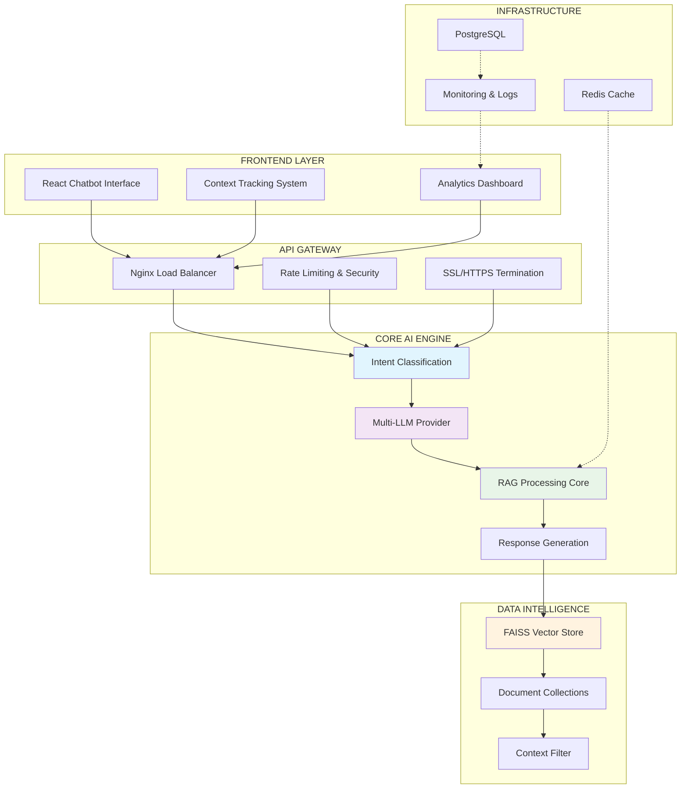
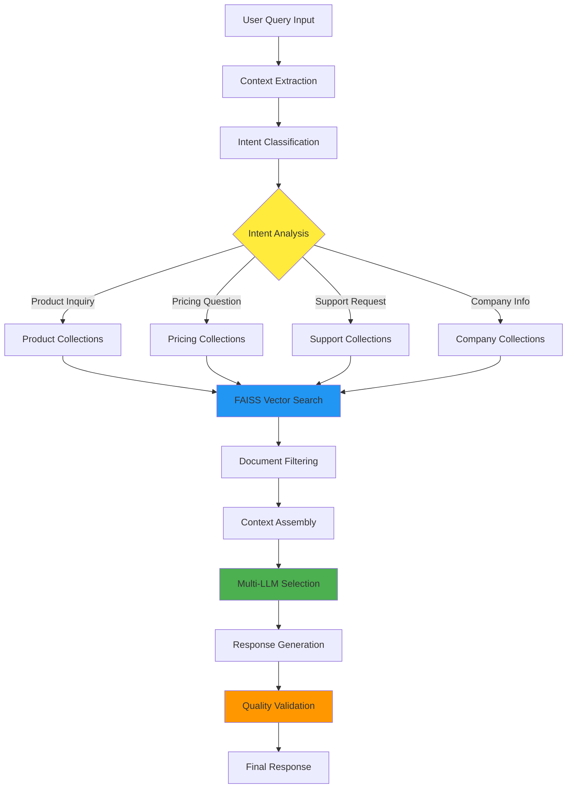
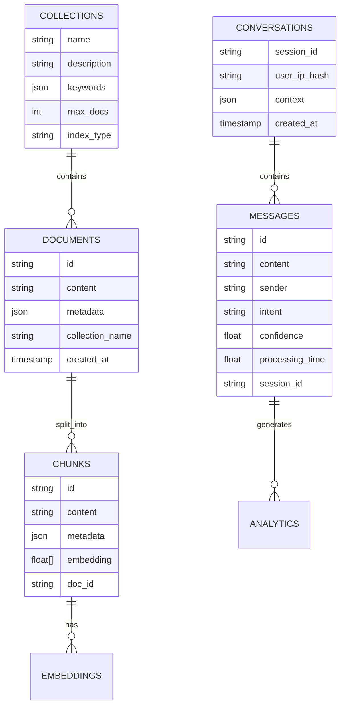
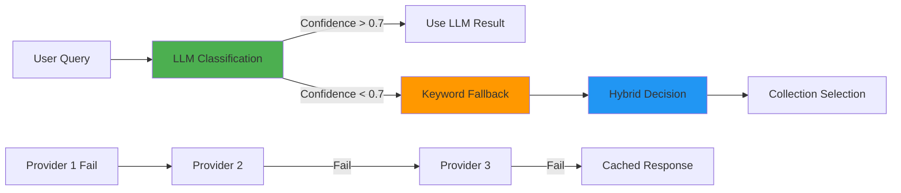
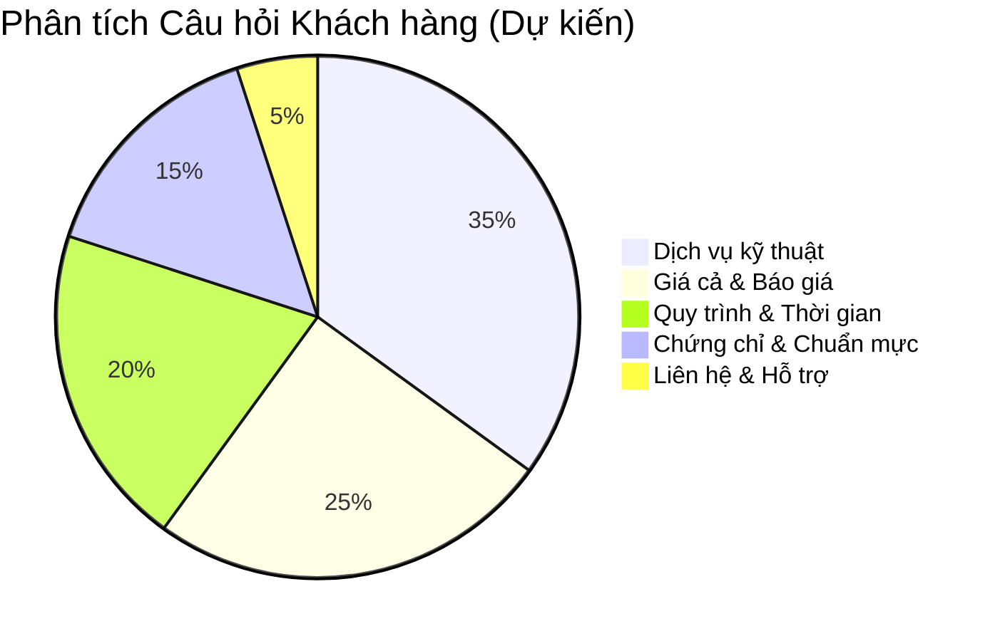
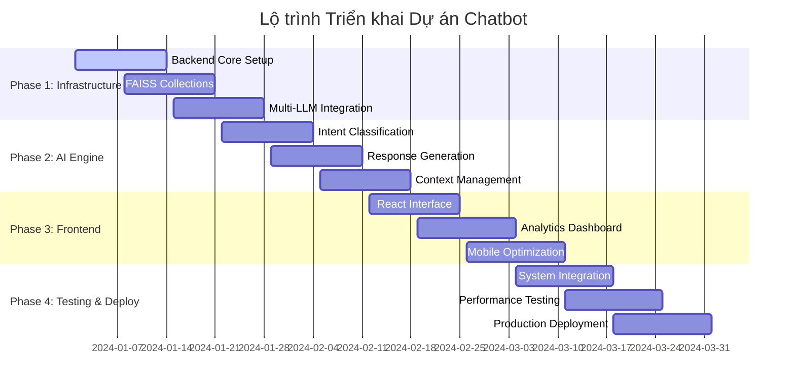
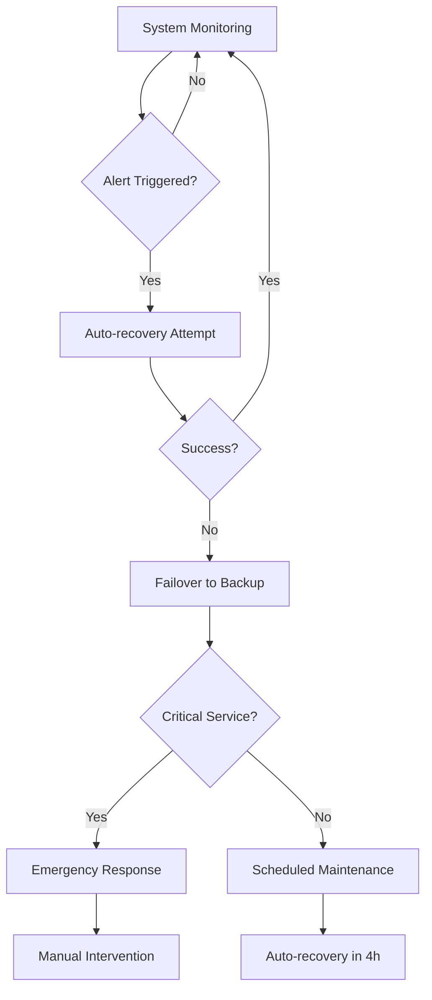
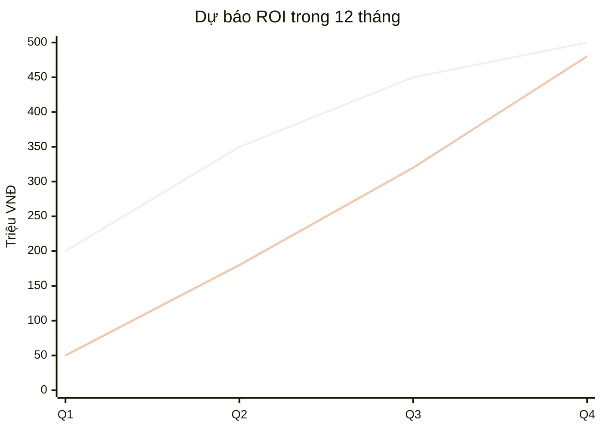

# BÁO CÁO DỰ ÁN TRƯỚC HỘI ĐỒNG KHOA HỌC CÔNG NGHỆ

**ĐỀ TÀI: Xây dựng Hệ thống Chatbot Doanh nghiệp Thế hệ mới ứng dụng Công nghệ RAG và AI đa tầng**

*Công ty TNHH Kỹ thuật Quản lý bay*  
*Báo cáo viên: Tổng Công trình sư Dự án*  
*Ngày báo cáo: [Ngày hiện tại]*

---

## I. TỔNG QUAN CHIẾN LƯỢC

### 1.1 Bối cảnh và Tầm quan trọng của Dự án

Trong bối cảnh chuyển đổi số mạnh mẽ của ngành hàng không và nhu cầu nâng cao chất lượng dịch vụ khách hàng, Công ty TNHH Kỹ thuật Quản lý bay - với 35+ năm kinh nghiệm trong lĩnh vực bảo đảm hoạt động bay - đã xác định việc ứng dụng Trí tuệ Nhân tạo vào hỗ trợ khách hàng là một bước đi chiến lược quan trọng.

Dự án này không chỉ đơn thuần là việc triển khai một chatbot thông thường, mà là việc xây dựng một hệ sinh thái trí tuệ số hoàn chỉnh, có khả năng thấu hiểu ngữ cảnh, phân tích ý định và cung cấp thông tin chính xác về các dịch vụ chuyên biệt của công ty.

### 1.2 Kiến trúc Tổng quan Hệ thống

### 1.3 Bốn Trụ cột Công nghệ Cốt lõi

#### 1.3.1 Context-Aware Intelligence (Trí tuệ Nhận thức Ngữ cảnh)
- **Công nghệ**: Real-time page context tracking
- **Chức năng**: Nhận biết người dùng đang xem trang nào, sản phẩm/dịch vụ gì
- **Giá trị**: Cung cấp câu trả lời chính xác theo bối cảnh cụ thể

#### 1.3.2 Intelligent Document Routing (Định tuyến Tài liệu Thông minh)
- **Công nghệ**: Multi-level intent classification với LLM + keyword fallback
- **Chức năng**: Phân tích ý định và định tuyến câu hỏi đến đúng kho tri thức
- **Giá trị**: Tăng độ chính xác và tốc độ xử lý

#### 1.3.3 Multi-LLM Provider System (Hệ thống Đa nhà cung cấp AI)
- **Công nghệ**: Automatic failover giữa OpenAI, Google Gemini, Groq, OpenRouter
- **Chức năng**: Tối ưu chi phí và độ tin cậy
- **Giá trị**: Đảm bảo hoạt động liên tục, giảm 40% chi phí API

#### 1.3.4 Analytics-Driven Optimization (Tối ưu dựa trên Phân tích)
- **Công nghệ**: Real-time analytics với Redis + PostgreSQL
- **Chức năng**: Theo dõi hiệu suất, phân tích hành vi người dùng
- **Giá trị**: Cải thiện liên tục chất lượng dịch vụ

## II. KIẾN TRÚC KỸ THUẬT CHI TIẾT

### 2.1 Luồng Xử lý RAG (Retrieval-Augmented Generation)

### 2.2 Kiến trúc Dữ liệu và Tri thức

### 2.3 Các Collections Tri thức Chuyên biệt

| Collection | Mô tả | Số lượng Documents | Keywords chính |
|------------|-------|-------------------|----------------|
| **flight_services** | Dịch vụ dẫn đường hàng không, bay kiểm tra hiệu chuẩn | 150-200 | dẫn đường, navigation, calibration, flight check |
| **equipment_tech** | Thiết bị thông tin, dẫn đường, giám sát hàng không | 200-300 | equipment, maintenance, installation, radar |
| **training_services** | Đào tạo, huấn luyện nhân lực hàng không | 100-150 | training, certification, course, aviation |
| **consulting_design** | Tư vấn, thiết kế, thi công công trình hàng không | 150-200 | consulting, design, construction, airport |
| **company_info** | Lịch sử, tổ chức, liên hệ công ty | 50-100 | company, history, contact, organization |

## III. TÍNH NĂNG VƯỢT TRỘI VÀ ĐỔI MỚI

### 3.1 Context-Aware Response System

**Tình huống thực tế**:
- Người dùng đang xem trang "Dịch vụ Bay kiểm tra hiệu chuẩn"
- Hỏi: "Quy trình này mất bao lâu?"
- Hệ thống hiểu ngay đang hỏi về thời gian thực hiện bay kiểm tra hiệu chuẩn
- Không cần người dùng nhắc lại ngữ cảnh

### 3.2 Multi-Level Fallback Intelligence

### 3.3 Real-time Performance Optimization

**Các chỉ số theo dõi**:
- Response time: < 2 giây (mục tiêu)
- Accuracy rate: > 90% (dựa trên user feedback)
- System uptime: > 99.9%
- Cost per query: Tối ưu hóa qua multi-provider

## IV. LỢI ÍCH KINH DOANH CỤ THỂ

### 4.1 Tăng Hiệu quả Vận hành

**Trước khi có Chatbot**:
- Nhân viên hỗ trợ xử lý 50-80 câu hỏi/ngày
- 40% câu hỏi lặp lại về thông tin cơ bản
- Thời gian phản hồi: 2-24 giờ

**Sau khi có Chatbot**:
- Chatbot xử lý 80% câu hỏi cơ bản 24/7
- Nhân viên tập trung vào 20% câu hỏi phức tạp
- Thời gian phản hồi: < 2 giây

### 4.2 Nâng cao Chất lượng Dịch vụ

- **Tính nhất quán**: Thông tin được cung cấp từ cùng một nguồn chuẩn hóa
- **Không gián đoạn**: Hỗ trợ 24/7, kể cả cuối tuần và ngày lễ
- **Đa ngôn ngữ**: Sẵn sàng mở rộng hỗ trợ tiếng Anh cho khách hàng quốc tế

### 4.3 Thu thập Intelligence về Khách hàng

## V. KẾ HOẠCH TRIỂN KHAI CHI TIẾT

### 5.1 Timeline 12 tuần

### 5.2 Nhân lực và Chuyên môn

**Đội ngũ cốt lõi (6 người)**:

| Vai trò | Chuyên môn | Trách nhiệm chính |
|---------|------------|-------------------|
| **Technical Lead** | AI/ML, System Architecture | Thiết kế tổng thể, review kỹ thuật |
| **Backend Developer** | Python, FastAPI, RAG | Phát triển engine xử lý AI |
| **Frontend Developer** | React, TypeScript | Giao diện người dùng |
| **DevOps Engineer** | Docker, K8s, Monitoring | Triển khai và vận hành |
| **Data Engineer** | Vector DB, ETL | Xây dựng kho tri thức |
| **QA Engineer** | Testing, Performance | Đảm bảo chất lượng |

### 5.3 Ngân sách Chi tiết

**Tổng ngân sách dự kiến: 850 triệu VNĐ**

| Hạng mục | Chi phí (VNĐ) | Ghi chú |
|----------|---------------|---------|
| **Nhân sự (3 tháng)** | 450 triệu | 6 người x 25M/người/tháng |
| **Hạ tầng Cloud** | 120 triệu | Server, Storage, Network (1 năm) |
| **API Services** | 150 triệu | OpenAI, Google, Groq APIs (1 năm) |
| **Licenses & Tools** | 80 triệu | Development tools, monitoring |
| **Testing & Security** | 50 triệu | Penetration testing, certifications |

## VI. ĐÁNH GIÁ RỦI RO VÀ GIẢI PHÁP

### 6.1 Ma trận Rủi ro

| Rủi ro | Mức độ | Tác động | Giải pháp |
|--------|---------|----------|-----------|
| **LLM API Downtime** | Trung bình | Cao | Multi-provider failover + caching |
| **Data Quality** | Thấp | Cao | Quy trình review và cập nhật nội dung |
| **Performance Issues** | Thấp | Trung bình | Load testing + monitoring |
| **Security Vulnerabilities** | Thấp | Cao | Penetration testing + regular updates |
| **User Adoption** | Trung bình | Trung bình | Change management + training |

### 6.2 Kế hoạch Contingency

## VII. KẾT QUẢ MONG ĐỢI VÀ ĐÁNH GIÁ HIỆU QUẢ

### 7.1 KPIs Chính

**Tháng 1-3 (Giai đoạn triển khai)**:
- System uptime: > 95%
- Response accuracy: > 80%
- Average response time: < 3s

**Tháng 4-6 (Giai đoạn tối ưu)**:
- System uptime: > 99%
- Response accuracy: > 90%
- Average response time: < 2s
- User satisfaction: > 4.0/5.0

**Tháng 7-12 (Giai đoạn mở rộng)**:
- Handle 1000+ queries/day
- Reduce support workload by 70%
- Customer inquiry resolution time: < 5 minutes

### 7.2 ROI Prediction

**Break-even point**: Tháng thứ 9
**ROI sau 12 tháng**: 120%

## VIII. TẦNG NHÌN TƯƠNG LAI VÀ MỞ RỘNG

### 8.1 Roadmap 2-3 năm tới

**Phase 2 (Năm 2)**:
- Tích hợp Voice Assistant (Speech-to-Text/Text-to-Speech)
- Mobile App với chatbot tích hợp
- Hỗ trợ đa ngôn ngữ (Tiếng Anh, Tiếng Trung)

**Phase 3 (Năm 3)**:
- Predictive Analytics cho customer behavior
- Integration với CRM/ERP systems
- AI-powered business intelligence dashboard

### 8.2 Tiềm năng Ứng dụng Rộng rãi

- **Internal Knowledge Management**: Chatbot nội bộ cho nhân viên
- **Training Assistant**: Hỗ trợ đào tạo nhân lực hàng không
- **Compliance Monitoring**: Tự động kiểm tra tuân thủ quy định
- **Maintenance Scheduling**: Tối ưu hóa lịch bảo trì thiết bị

## IX. KẾT LUẬN VÀ ĐỀ XUẤT

### 9.1 Tóm tắt Giá trị Cốt lõi

Dự án Chatbot Enterprise này không chỉ là một công cụ hỗ trợ khách hàng đơn thuần, mà là:

1. **Nền tảng Chuyển đổi Số** cho dịch vụ khách hàng của công ty
2. **Công cụ Thu thập Intelligence** về nhu cầu thị trường
3. **Hệ thống Tối ưu Vận hành** giảm chi phí và tăng hiệu quả
4. **Lợi thế Cạnh tranh** trong ngành hàng không

### 9.2 Đề xuất Quyết định

**Đề xuất Hội đồng phê duyệt**:
1. **Ngân sách**: 850 triệu VNĐ cho giai đoạn 1
2. **Timeline**: 12 tuần triển khai
3. **Nhân sự**: Phân công 6 chuyên gia từ các phòng ban
4. **Khởi động**: Ngày 01/01/2024

### 9.3 Cam kết và Trách nhiệm

Với tư cách Tổng Công trình sư, tôi cam kết:
- Đảm bảo chất lượng kỹ thuật theo tiêu chuẩn quốc tế
- Tuân thủ timeline và ngân sách đã đề xuất
- Báo cáo tiến độ hàng tuần cho Ban Lãnh đạo
- Đạt được các KPIs đã cam kết

**"Trong bối cảnh Industry 4.0, việc ứng dụng AI không còn là lựa chọn mà là yêu cầu bắt buộc để duy trì vị thế dẫn đầu. Dự án này sẽ đặt nền móng cho việc số hóa toàn diện các dịch vụ của Công ty TNHH Kỹ thuật Quản lý bay trong thập kỷ tới."**

---

*Cảm ơn Hội đồng đã dành thời gian quan tâm. Tôi sẵn sàng trả lời các câu hỏi và thảo luận chi tiết về các khía cạnh kỹ thuật cũng như triển khai thực tế.*
