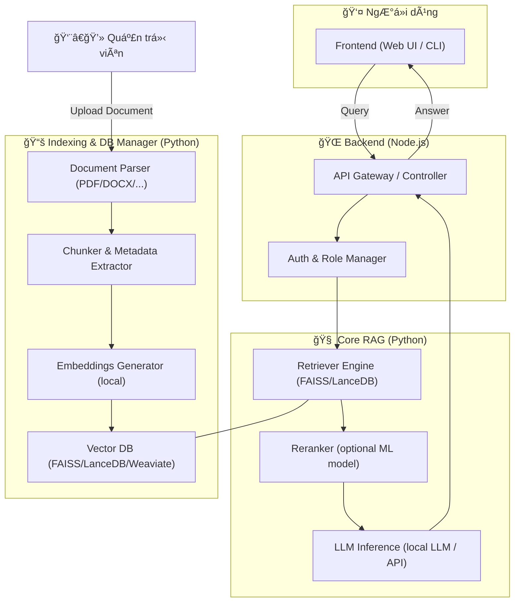
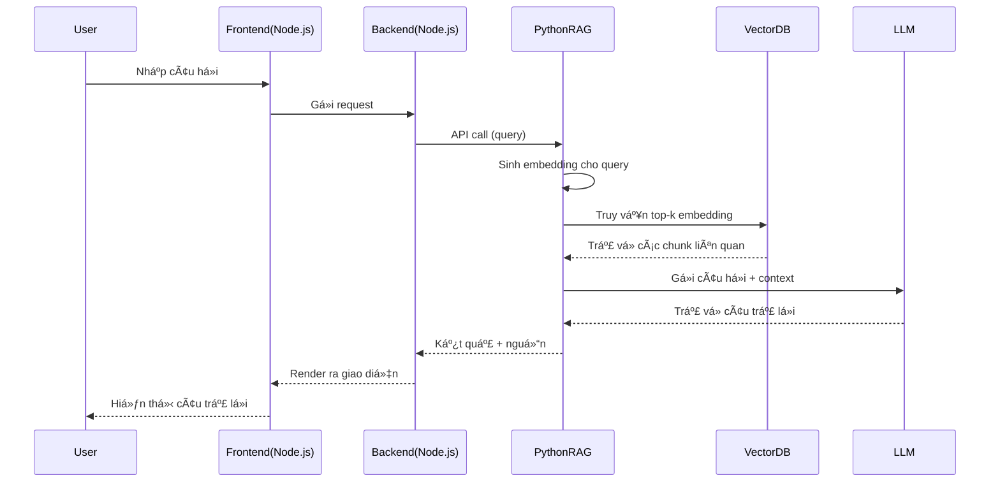
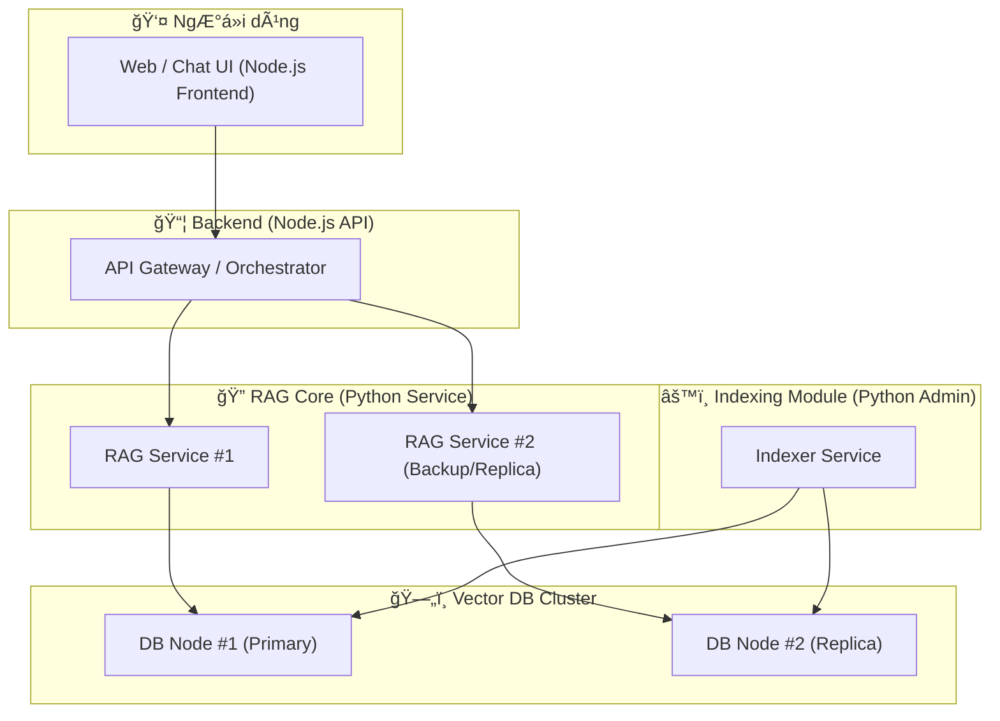
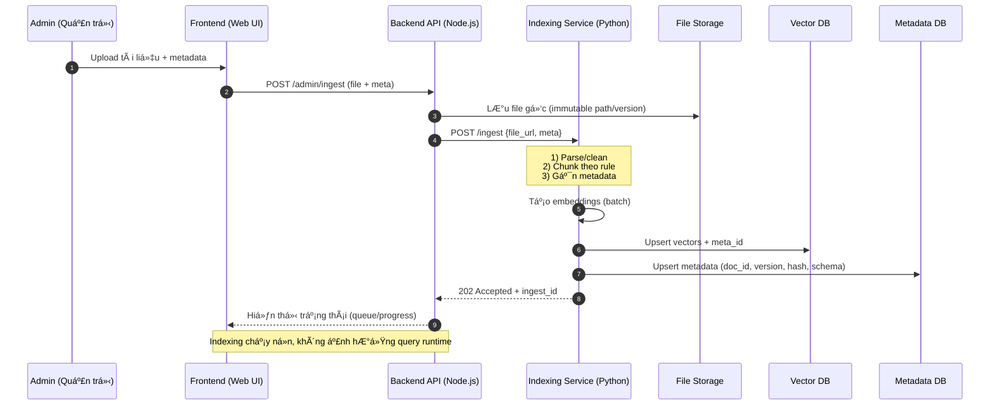
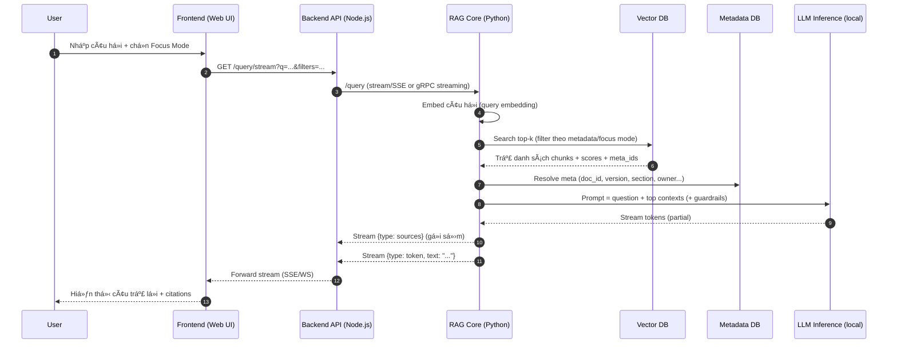

Tuyệt — dưới đây là một bản **thiết kế hệ thống RAG chạy local** theo mô hình **UI/Node.js + Core Python**, tận dụng “focus modes†kiểu Perplexica và vẫn thuần offline.

# Kiến trúc tổng thể

**(1) Frontend (Next.js/React + Tailwind, TS)**
→ Chat UI, chá»n “Focus Modeâ€, hiển thị citation, stream từng token.

**(2) API Gateway (Node.js/TypeScript – Express hoặc NestJS)**
→ Xác thực cục bộ, rate-limit, logging; **proxy** đến Python RAG.
→ Cung cấp **REST + WebSocket/SSE** ổn định cho frontend.

**(3) RAG Core (Python/FastAPI)**

* **Ingestor**: parse → chunk → gắn metadata (category/section/date/department/product…).
* **Embeddings** (local): `sentence-transformers` hoặc **Ollama embeddings**.
* **Vector DB**: FAISS (nhẹ) hoặc Qdrant/Chroma (metadata mạnh).
* **Retriever + Reranker**: cosine hoặc cross-encoder (tùy tài nguyên).
* **Generator (LLM local)**: Ollama (mistral/llama3/gemma) → **stream**.
* **Focus Modes** = filter theo metadata trÆ°á»›c khi retrieve.

**(4) Runtime phụ trợ (local)**

* **Ollama** (pull model, offline).
* (Tùy chá»n) **Qdrant/Chroma** chạy bằng Docker.

---

## Luồng dữ liệu

1. **Ingest**: Frontend tải file/Ä‘iá»n metadata → Node `/api/ingest` → Python `/ingest`
   → parse + chunk (500–1000 tokens, overlap 100–200) → embed → upsert vào vector DB.

2. **Query**: Frontend gửi query + focus mode → Node `/api/query/stream`
   → Node mở stream đến Python `/query/stream` kèm `{query, filters}`
   → Python retrieve (filter metadata) → rerank → prompt LLM → **stream token** → đẩy ngược lên frontend kèm **danh sách nguồn (citations)**.

---

## Metadata & Focus Modes (gợi ý cho tài liệu nội bộ)

* `category`: `quy_dinh | quy_che | huong_dan | san_pham | khac`
* `section`: mục/chương
* `date`: ngày ban hành
* `department`: phòng ban
* `product`: mã sản phẩm
* `version`: số phiên bản

Frontend chỉ cần render dropdown **Focus Mode** → map sang bá»™ lá»c metadata.

---

## API Contracts (tối giản)

### Node → Python (private)

`POST /ingest`

```json
{ "doc_id":"QD-ATLD-2022", "text":"...", "meta":{"category":"quy_dinh","date":"2022-05-01","department":"HanhChinh"} }
```

`POST /query` (không stream – để debug)

```json
{ "query":"Quy trình xử lý sự cố sản phẩm X?", "filters":{"category":"huong_dan","product":"X"}, "top_k":5 }
```

`POST /query/stream` (SSE hoặc WS)
payload như trên; response: dòng `data:` chứa JSON:

```json
{ "type":"token","text":"..."}
{ "type":"sources","items":[{"doc_id":"HD-SPX","section":"2.3","score":0.82}] }
{ "type":"done" }
```

### Frontend → Node (public)

* `POST /api/ingest` (multipart hoặc JSON)
* `POST /api/query`
* `GET  /api/query/stream` (SSE) hoặc `ws://.../api/query/socket`

---

## Cấu trúc thư mục (mono-repo)

```
rag-local/
├── frontend/            # Next.js (TS) + Tailwind
├── gateway/             # Node.js (TS) – Express/NestJS
├── rag_core/            # Python – FastAPI
├── data/                # raw docs, processed
├── vectordb/            # FAISS index / Qdrant volume
└── docker-compose.yml
```

---

## Docker Compose (rút gá»n)

```yaml
services:
  ollama:
    image: ollama/ollama:latest
    volumes: [ "ollama:/root/.ollama" ]
    ports: ["11434:11434"]

  rag_core:
    build: ./rag_core
    environment:
      - OLLAMA_BASE=http://ollama:11434
      - VECTOR_DB=faiss
    volumes:
      - ./vectordb:/app/vectordb
      - ./data:/app/data
    ports: ["8001:8001"]
    depends_on: [ollama]

  gateway:
    build: ./gateway
    environment:
      - PY_BACKEND=http://rag_core:8001
    ports: ["8000:8000"]
    depends_on: [rag_core]

  frontend:
    build: ./frontend
    environment:
      - GATEWAY_BASE=http://gateway:8000
    ports: ["3000:3000"]
    depends_on: [gateway]

volumes:
  ollama:
```

---

## Python RAG Core – FastAPI (tối giản, chạy được)

```python
# rag_core/app.py
from fastapi import FastAPI, Request
from fastapi.responses import StreamingResponse, JSONResponse
from pydantic import BaseModel
import uvicorn, os, json, io, time
import faiss, numpy as np
from sentence_transformers import SentenceTransformer

app = FastAPI()

EMB = SentenceTransformer("sentence-transformers/all-MiniLM-L6-v2")
DIM = EMB.get_sentence_embedding_dimension()
INDEX = faiss.IndexFlatIP(DIM)          # IP ~ cosine nếu đã normalize
CHUNKS, METAS = [], []                  # demo: lưu RAM, thực tế lưu đĩa

def normalize(v):
    n = np.linalg.norm(v)
    return v / max(n, 1e-12)

class IngestReq(BaseModel):
    doc_id: str
    text: str
    meta: dict = {}

@app.post("/ingest")
def ingest(req: IngestReq):
    # naive chunker
    words = req.text.split()
    step, size, overlap = 800-200, 800, 200
    ids, vecs = [], []
    for i in range(0, len(words), step):
        chunk = " ".join(words[i:i+size])
        if not chunk: break
        CHUNKS.append(chunk)
        METAS.append({**req.meta, "doc_id": req.doc_id, "idx": len(CHUNKS)-1})
        v = normalize(EMB.encode([chunk])[0].astype("float32"))
        vecs.append(v)
        ids.append(len(CHUNKS)-1)
    INDEX.add(np.array(vecs))
    return {"added": len(ids)}

class QueryReq(BaseModel):
    query: str
    filters: dict | None = None
    top_k: int = 5

def filter_indices(filters):
    if not filters: return list(range(len(METAS)))
    out = []
    for i,m in enumerate(METAS):
        ok = all(m.get(k)==v for k,v in filters.items())
        if ok: out.append(i)
    return out

@app.post("/query")
def query(req: QueryReq):
    qv = normalize(EMB.encode([req.query])[0].astype("float32"))
    D, I = INDEX.search(np.array([qv]), k=min(req.top_k*4, len(CHUNKS)))
    cand = [idx for idx in I[0] if idx in filter_indices(req.filters)]
    cand = cand[:req.top_k]
    items = [{"text": CHUNKS[i], "meta": METAS[i]} for i in cand]
    return {"contexts": items}

@app.post("/query/stream")
async def query_stream(req: Request):
    body = await req.json()
    q = body.get("query","")
    filters = body.get("filters", {})
    top_k = int(body.get("top_k",5))

    # retrieve
    data = query(QueryReq(query=q, filters=filters, top_k=top_k))

    # giả lập sinh token; khi tích hợp Ollama thì stream thật tại đây
    async def gen():
        # gửi nguồn trước
        yield f"data: {json.dumps({'type':'sources','items':[i['meta'] for i in data['contexts']]})}\n\n"
        answer = " ".join(["Trả lá»i dá»±a trên các nguồn đã tìm thấy."])  # placeholder
        for tok in answer.split():
            yield f"data: {json.dumps({'type':'token','text':tok+' '})}\n\n"
            time.sleep(0.05)
        yield f"data: {json.dumps({'type':'done'})}\n\n"

    return StreamingResponse(gen(), media_type="text/event-stream")

if __name__ == "__main__":
    uvicorn.run("app:app", host="0.0.0.0", port=8001, reload=True)
```

> Nâng cấp dễ nhất: thay phần “placeholder answer†bằng call **Ollama** (`/api/chat`) và stream chunk vỠSSE:

* Lấy `context = "\n\n".join(ctx['text'] for ctx in data['contexts'])`
* Prompt LLM: *“Bạn là trợ lý… Hãy trả lá»i dá»±a trên context sau: …â€*
* Dùng `httpx.stream("POST", OLLAMA/chat, ...)` để forward token.

---

## Node.js Gateway – Express (TS) proxy & stream

```ts
// gateway/src/index.ts
import express from "express";
import cors from "cors";
import fetch from "node-fetch";

const app = express();
app.use(cors());
app.use(express.json());

const PY = process.env.PY_BACKEND || "http://localhost:8001";

app.post("/api/ingest", async (req, res) => {
  const r = await fetch(`${PY}/ingest`, { method: "POST", headers: { "content-type":"application/json" }, body: JSON.stringify(req.body) });
  const j = await r.json();
  res.json(j);
});

app.get("/api/query/stream", async (req, res) => {
  // client gá»­i ?q=...&category=...
  const q = req.query.q as string;
  const category = req.query.category as string | undefined;
  res.setHeader("Content-Type", "text/event-stream");
  res.setHeader("Cache-Control", "no-cache");
  res.setHeader("Connection", "keep-alive");

  const py = await fetch(`${PY}/query/stream`, {
    method: "POST",
    headers: { "content-type":"application/json" },
    body: JSON.stringify({ query: q, filters: category ? { category } : {} })
  });

  if (!py.body) { res.end(); return; }
  py.body.on("data", (chunk:any)=> res.write(chunk));
  py.body.on("end", ()=> res.end());
});

app.listen(8000, ()=> console.log("Gateway on :8000"));
```

---

## Frontend (Next.js) – gá»i SSE rất gá»n

```ts
// frontend/app/page.tsx (pseudo)
"use client";
import { useState } from "react";

export default function Home() {
  const [q, setQ] = useState("");
  const [mode, setMode] = useState("all");
  const [out, setOut] = useState("");

  const run = () => {
    setOut("");
    const url = `/api/query/stream?q=${encodeURIComponent(q)}${mode!=="all" ? `&category=${mode}`:""}`;
    const es = new EventSource(url);
    es.onmessage = (ev) => {
      const msg = JSON.parse(ev.data);
      if (msg.type === "token") setOut(o=> o + msg.text);
      if (msg.type === "sources") console.log("sources:", msg.items);
      if (msg.type === "done") es.close();
    };
  };

  return (
    <main className="p-6 max-w-3xl mx-auto">
      <h1 className="text-2xl font-bold mb-4">Local RAG</h1>
      <div className="flex gap-2 mb-3">
        <input className="border p-2 flex-1" value={q} onChange={e=>setQ(e.target.value)} placeholder="Nhập câu há»i..." />
        <select className="border p-2" value={mode} onChange={e=>setMode(e.target.value)}>
          <option value="all">All</option>
          <option value="quy_dinh">Quy định</option>
          <option value="quy_che">Quy chế</option>
          <option value="huong_dan">Hướng dẫn</option>
          <option value="san_pham">Sản phẩm</option>
        </select>
        <button className="border px-4" onClick={run}>Há»i</button>
      </div>
      <pre className="whitespace-pre-wrap">{out}</pre>
    </main>
  );
}
```

---

## Lá»™ trình nâng cấp “từ dá»… đến khóâ€

1. **Chạy bản tối giản** (FAISS + MiniLM): ingest → retrieve → SSE stream (placeholder).
2. **Thêm LLM Ollama** (mistral/llama3) → stream thật.
3. **Rerank**: chuyển sang cosine chuẩn (normalize), hoặc thêm cross-encoder khi đủ GPU.
4. **Vector DB có metadata**: chuyển FAISS → **Qdrant/Chroma** để filter mạnh.
5. **UI**: render citations (meta: doc\_id/section/date), bá»™ lá»c nâng cao (department/product/version).
6. **Bảo mật nội bộ**: basic auth / token cục bộ trên Gateway; audit log query.

---

Nếu anh muốn, tôi có thể tạo **repo skeleton** theo đúng khung trên (4 thư mục + compose + code khởi điểm) để anh chạy thử ngay trên máy.

Rất chuẩn. Mình sẽ không đưa code vội mà tập trung **kiến trúc hệ thống RAG chạy local** với 2 thành phần chính: **Node.js (UI + backend API)** và **Python (RAG core)**.

---

## 🗠Kiến trúc hệ thống RAG Local (Node.js + Python)

### 1. **Frontend Web UI (Node.js/React/Next.js)**

* Vai trò:

  * Giao diện web để ngÆ°á»i dùng nhập câu há»i, xem câu trả lá»i, quản lý tài liệu.
  * Có thể có dashboard: upload file PDF/Word, xem logs, quản lý dữ liệu.
* Giao tiếp:

  * Gửi request HTTP/REST hoặc WebSocket tới Backend API (Node.js).
  * Hiển thị kết quả trả vỠtừ RAG core.

---

### 2. **Backend API Layer (Node.js/Express hoặc NestJS)**

* Vai trò:

  * Trung gian giữa Web UI và Python Core.
  * Quản lý session ngÆ°á»i dùng, phân quyá»n, logging.
  * Tích hợp các service khác (nếu cần, ví dụ ElasticSearch, PostgreSQL…).
* Giao tiếp:

  * Nhận request từ frontend.
  * Forward câu há»i hoặc yêu cầu xá»­ lý sang **Python Core** thông qua REST API hoặc gRPC.
  * Nhận kết quả từ Python và trả vỠfrontend.

---

### 3. **RAG Core (Python)**

* Vai trò: Xử lý toàn bộ **retrieval + generation**.

* Các khối con:

  1. **Document Loader**

     * Nhận file PDF/DOCX/TXT từ backend.
     * Chuyển thành text raw.
  2. **Text Splitter & Preprocessor**

     * Chia tài liệu thành chunk (ví dụ 500–1000 từ).
     * Có thể thêm metadata: loại văn bản (quy định, hướng dẫn…), ngày phát hành, phòng ban.
  3. **Embedding Generator**

     * Sinh vector cho từng chunk bằng mô hình embedding (SentenceTransformers, OpenAI embedding, BGE-m3…).
  4. **Vector Database**

     * Lưu trữ embedding + metadata (FAISS, ChromaDB, Weaviate, hoặc PostgreSQL+pgvector).
  5. **Retriever**

     * Nhận query từ user → sinh embedding query → tìm k chunks liên quan nhất.
  6. **LLM (Local hoặc Remote)**

     * Input: query + context (các chunk).
     * Output: câu trả lá»i cuối.
     * Có thể là local LLaMA/Mistral/GPTQ hoặc remote API (OpenAI, Groq).
  7. **Response Formatter**

     * Chuẩn hóa kết quả (text, Markdown, JSON…).
     * Gửi trả vỠNode.js.

* Giao tiếp:

  * Python expose REST API (FastAPI/Flask) hoặc gRPC endpoint.
  * Node.js gá»i API này.

---

### 4. **Storage**

* **Vector DB**: chứa embeddings (ChromaDB/FAISS).
* **Relational DB (tuỳ chá»n)**: PostgreSQL/MySQL để lÆ°u metadata, logs, quản lý user.
* **File Storage**: để giữ raw documents upload.

---

### 5. **Logging & Monitoring**

* Node.js log request/response (ai há»i gì, khi nào).
* Python log chi tiết xá»­ lý RAG (chunk nào được chá»n, embedding model nào dùng…).

---

## 🔗 Luồng dữ liệu (Flow)

1. User → Web UI (nhập câu há»i hoặc upload tài liệu).
2. Web UI → Backend Node.js (gửi request).
3. Node.js → Python Core (gá»i API).
4. Python Core:

   * Nếu upload: load + split + embedding → lưu vào Vector DB.
   * Nếu query: embed query → retrieve từ Vector DB → gá»i LLM → generate answer.
5. Python Core → Node.js Backend → Web UI (trả kết quả).

---

👉 Như vậy:

* **Node.js** = giao diện + API management.
* **Python** = não (RAG engine).
* Chúng **độc lập rõ ràng**, giao tiếp qua API. Nếu sau này bạn muốn thay Python bằng Rust hay thêm GPU cluster → chỉ cần giữ API contract.

---

Bạn có muốn mình vẽ **sơ đồ khối trực quan** cho kiến trúc này để dễ hình dung (kiểu architecture diagram) không?

à tưởng của bạn hoàn toàn hợp lý ğŸ‘. Mình phân tích kiến trúc triển khai theo hÆ°á»›ng **modular** và **dá»… mở rá»™ng** nhé:

---

## ğŸ—ï¸ Kiến trúc triển khai RAG Local (Node.js + Python)

### 1. **Core RAG + Database (Python Service)**

* Chạy trên **PC Server nội bộ** (máy mạnh, có GPU thì càng tốt).
* Thành phần:

  * **Document Loader + Chunking** (chia tài liệu): Python.
  * **Vector Database**: FAISS, Weaviate, hoặc Qdrant.
  * **Retriever + LLM Pipeline**: Python (LangChain, LlamaIndex, hoặc custom).
  * Expose API qua **FastAPI/Flask** (RESTful hoặc gRPC).
* Vai trò: “cái đầuâ€, xá»­ lý NLP, tìm kiếm semantic, sinh câu trả lá»i.

---

### 2. **Backend Gateway (Node.js)**

* Có thể chạy trên **máy khác** hoặc Docker trong cùng LAN.
* Thành phần:

  * **API Gateway**: nhận request từ frontend, forward sang Python Core.
  * **Auth & Role** (nếu cần bảo mật nội bộ).
  * **Session Manager** (theo dõi hội thoại).
  * **WebSocket/Streaming** để trả kết quả real-time.
* Vai trò: “cái miệng và tai†của hệ thống, giao tiếp với frontend.

---

### 3. **Frontend (React/Next.js)**

* Chạy ở **máy client** hoặc deploy chung với backend Node.js.
* Thành phần:

  * UI dạng chat giống Perplexica/ChatGPT.
  * Upload tài liệu (nếu cho phép import document).
  * Hiển thị kết quả + Highlight đoạn context lấy ra.
* Vai trò: “mặt tiá»nâ€, giúp user tÆ°Æ¡ng tác trá»±c quan.

---

### 4. **Triển khai**

* Có 2 cách:

  1. **Docker Compose**: gom Node.js + Python + Database vào 1 máy. Dễ setup, khó scale.
  2. **Multi-Machine Setup**:

     * Máy A (Python Core + Database).
     * Máy B (Node.js Backend + Frontend).
     * Client chỉ cần truy cập qua IP/Domain của máy B.

  * Bạn có thể chá»n **PC server chạy Core Python** và **má»™t PC nhá» hÆ¡n hoặc VM chạy Node.js backend**.

---

## 🔄 Luồng dữ liệu

1. User gõ câu há»i trên **Frontend**.
2. **Node.js Backend** nhận → gá»i API Python Core.
3. Python Core:

   * Tìm kiếm trong vectorDB.
   * Sinh câu trả lá»i từ LLM.
   * Trả vỠJSON.
4. Node.js Backend stream kết quả → Frontend hiển thị.

---

✅ Ưu điểm:

* Tách biệt rõ ràng: Python tập trung ML/RAG, Node.js lo giao diện và API.
* Dễ thay thế backend (VD: muốn đổi giao diện từ web → mobile thì không ảnh hưởng Core RAG).
* Có thể mở rộng theo microservices (thêm service quản lý tài liệu, logging, monitoring).

---

👉 Theo mình, vá»›i yêu cầu của bạn (100 trang A4 ná»™i bá»™), **cách Multi-Machine Setup (Python core 1 PC, Node.js backend 1 PC khác)** sẽ rất gá»n. Sau này scale thì chỉ cần nâng máy Python core.

---

Bạn có muốn mình vẽ **sơ đồ kiến trúc (block diagram)** cho hệ thống này để nhìn trực quan hơn không?

Tốt rồi 😄 — mình sẽ tập trung giúp bạn ra các **kiến trúc RAG local** rõ ràng, dễ triển khai, để bạn nhìn vào là thấy cách ghép nối ngay.

---

# ğŸ—ï¸ Kiến trúc tổng thể RAG Local (Node.js + Python)

## 1. Các khối chính

1. **Frontend (Web UI)**

   * Viết bằng **React/Next.js (Node.js ecosystem)** hoặc tận dụng UI từ Perplexica.
   * Chức năng: nhập câu há»i, hiển thị câu trả lá»i, log truy vấn, hiển thị tài liệu liên quan.
   * Giao tiếp với backend qua **REST API / WebSocket**.

2. **Backend Gateway (Node.js Express/NestJS)**

   * Vai trò: **cầu nối** giữa Web UI và Python Core.
   * Quản lý user session, auth (nếu cần), API endpoint `/ask`, `/upload`, `/search`.
   * Có thể cache kết quả tạm bằng Redis hoặc SQLite.
   * Nói chuyện với Python Core qua:

     * HTTP REST (Flask/FastAPI chạy riêng).
     * hoặc gRPC nếu muốn hiệu năng cao.

3. **Python Core (RAG Engine)**

   * Thành phần **quan trá»ng nhất**, chạy trên PC mạnh hÆ¡n.
   * Các module:

     * **Document Loader**: Ä‘á»c tài liệu (PDF, DOCX, TXT).
     * **Chunking & Embedding**: chia nhỠđoạn văn, nhúng bằng SentenceTransformers hoặc OpenAI local model.
     * **Vector Database**: FAISS, ChromaDB, Weaviate (chạy local).
     * **Retriever**: tìm đoạn văn phù hợp.
     * **LLM Wrapper**: gá»i model local (Llama.cpp, Ollama, vLLM) hoặc remote (OpenAI).
     * **RAG Pipeline**: orchestrator → input question → retrieve → context → LLM → answer.

4. **Database**

   * **Vector DB**: chứa embeddings. (FAISS/Chroma)
   * **Metadata DB**: SQLite/Postgres để lưu log, user query, mapping document → embedding.

5. **Optional: File Server / Storage**

   * Nếu tài liệu công ty nhiá»u, cần server lÆ°u trữ file gốc.
   * Gắn link ngược lại khi trả lá»i để user tham chiếu.

---

## 2. Luồng xử lý

1. User nhập câu há»i trên Web UI (Node.js frontend).
2. Backend Gateway (Node.js) nhận câu há»i, gá»­i qua REST/gRPC đến Python Core.
3. Python Core:

   * Nhúng câu há»i thành vector.
   * Truy vấn Vector DB → lấy top-k đoạn văn bản liên quan.
   * Ghép chúng thành prompt → gửi vào LLM local.
   * Nhận kết quả trả lá»i.
4. Backend Gateway gói kết quả (answer + nguồn tham chiếu) → gửi vỠfrontend.
5. Web UI hiển thị kết quả đẹp, highlight đoạn gốc.

---

## 3. Phân tách độc lập

* **Frontend**: chỉ lo UI, có thể thay đổi giao diện mà không đụng tới logic tìm kiếm.
* **Backend Node.js**: chỉ làm API gateway, quản lý auth, logging, rate-limit. Không dính RAG logic.
* **Python Core**: độc lập hoàn toàn, có thể nâng cấp mô hình, thay đổi FAISS ↔ Chroma mà backend không cần sửa.
* **Database**: có thể scale riêng, hoặc nhúng FAISS file ngay trên Python Core.

---

👉 Với kiến trúc này, bạn hoàn toàn có thể:

* Äặt **Python Core + Database** trên má»™t máy PC mạnh (GPU/CPU).
* Äặt **Frontend + Backend Node.js** trên máy server nhá» hÆ¡n (hoặc container khác).
* Giao tiếp qua mạng nội bộ (LAN/VPN).

---

Bạn có muốn mình vẽ **sơ đồ kiến trúc (diagram)** trực quan luôn không?

Anh nói rất đúng: **tầm nhìn 5 năm** cho má»™t hệ thống RAG local không chỉ là chạy được mà phải **dá»… mở rá»™ng, bảo trì, nâng cấp** khi công nghệ thay đổi (vector DB, LLM, framework web). Em sẽ phân tích cách hai bên (Node.js vs Python core RAG) **giao tiếp để không bị lá»—i thá»i**:

---

## 🔗 Kiến trúc giao tiếp (Communication Architecture)

### 1. **API Gateway (REST / gRPC / GraphQL)**

* **Backend Node.js** sẽ là **API Gateway**, tiếp nhận yêu cầu từ frontend.
* Giao tiếp với Python core RAG qua:

  * **REST API** → dễ triển khai, ai cũng dùng được, nhưng hơi chậm khi query nặng.
  * **gRPC** → nhanh, tối ưu binary, schema rõ ràng → phù hợp tầm nhìn 5 năm.
  * **GraphQL** → nếu muốn query dữ liệu RAG Ä‘a dạng (search theo chủ Ä‘á», theo thá»i gian, theo ngÆ°á»i soạn thảo…), nhÆ°ng hÆ¡i phức tạp để maintain.

👉 Gợi ý: **gRPC cho core RAG ↔ Node.js**, còn **REST cho frontend ↔ backend**.
Như vậy frontend dễ tích hợp, còn giữa backend với core thì nhanh & typed.

---

### 2. **Message Queue (MQ) cho tác vụ nặng**

Một số tác vụ không nên request-response trực tiếp:

* Indexing tài liệu (100 trang A4 → cần phân mảnh, embedding, lưu vector DB).
* Training/fine-tuning cục bộ.
* Chạy batch search hoặc multi-query.

👉 Dùng **RabbitMQ / Kafka / Redis Streams** để:

* Node.js gửi **job** vào hàng đợi.
* Python worker nhận job, xử lý, trả kết quả vào queue hoặc DB.
* Node.js Ä‘á»c kết quả, trả vá» frontend.

---

### 3. **Database làm cầu nối**

Một số dữ liệu nên lưu vào DB để tách biệt:

* Metadata (tài liệu, chủ Ä‘á», ngÆ°á»i tạo, ngày cập nhật).
* Vector embeddings (trong Milvus, Weaviate, hoặc PostgreSQL + pgvector).
* Logs / nhật ký truy vấn để phân tích sau này.

👉 Node.js chỉ cần Ä‘á»c metadata + kết quả query.
👉 Python xử lý embedding / RAG logic, rồi ghi kết quả vào DB.

---

## 📠Kiến trúc phân tầng (5 năm không lá»—i thá»i)

1. **Frontend (React / Next.js / Vue)**

   * Chỉ gá»i API → không phụ thuá»™c công nghệ RAG.
   * Dễ thay đổi giao diện, thêm tính năng mà không đụng core.

2. **Backend Gateway (Node.js + Express/NestJS)**

   * Quản lý Auth, User, API versioning.
   * Dá»… thay LLM core sau này, vì chỉ gá»i services.

3. **Core RAG Engine (Python)**

   * Quản lý: chunking, embedding, vector search, reranking, context building.
   * Có thể thay đổi mô hình (FAISS → Milvus → Weaviate → Qdrant) mà không ảnh hưởng frontend.

4. **Storage Layer**

   * DB quan hệ (Postgres/MySQL) → metadata & logs.
   * Vector DB (Qdrant/Milvus/Weaviate/pgvector) → lưu embeddings.

5. **Async Processing (MQ)**

   * Äảm bảo hệ thống không nghẽn khi upload tài liệu lá»›n.

---

## 🚀 Lợi ích

* **Không khóa chặt công nghệ**: đổi model từ Llama → Mistral → GPT4All vẫn ok.
* **Node.js layer làm mặt nạ**: frontend không biết anh dùng core Python gì.
* **Dễ mở rộng**: thêm dịch vụ AI khác (OCR, summarization, speech2text…) chỉ cần thêm 1 Python service và expose API.
* **Chạy đa máy**:

  * PC1: Core RAG (Python + DB).
  * PC2: Backend Gateway (Node.js).
  * PC3: Frontend Web.
  * Tất cả kết nối qua HTTP/gRPC/MQ → dễ tách microservice.

---

👉 Em đỠxuất:

* **Node.js ↔ Python qua gRPC** (cho tốc độ, typed).
* **Frontend ↔ Backend qua REST** (cho dễ xài).
* **Async qua RabbitMQ/Redis** (cho upload + indexing).

---

Anh muốn em vẽ **sơ đồ khối giao tiếp** cho kiến trúc này (kiểu diagram) để dễ hình dung không?

Anh xác định rất đúng hÆ°á»›ng rồi ğŸ‘. Äể mình phân tích kỹ hÆ¡n:

---

## ğŸ—ï¸ Vai trò của module **Indexing**

* Äây là **module quản trị dữ liệu** (data admin), Ä‘á»™c lập vá»›i **retrieval/querying**.
* Nó thực hiện:

  1. **Chia nhỠtài liệu** (chunking)
  2. **Tạo embedding** cho từng chunk
  3. **Lưu trữ embedding** cùng metadata (title, source, date, loại tài liệu, version…) vào vector database
* Chỉ chạy khi có **cập nhật tài liệu mới**, hoặc khi muốn làm lại toàn bộ index.

👉 Như vậy, hệ thống **search/query runtime** không phụ thuộc vào indexing. Nếu index bị lỗi, query engine vẫn chạy trên index cũ.

---

## ⓠCó cần **fine-tuning** hay **training** không?

Với **RAG cơ bản** (như anh nói – tài liệu nội bộ, văn bản công ty):

* **KHÔNG cần fine-tuning**.
* Chỉ cần **embedding model** (ví dụ: OpenAI text-embedding, hoặc local model như `sentence-transformers`, `bge-small`, `mxbai-embed-large`) để nhúng text thành vector.
* Sau đó RAG sẽ hoạt Ä‘á»™ng: Query → Embedding → Search trong vectorDB → Retrieve context → Prompt vào LLM → Trả lá»i.

### Khi nào mới cần **fine-tuning**?

* Nếu tài liệu của anh có nhiá»u **thuật ngữ chuyên ngành riêng** (VD: quy định hàng không, thiết bị đặc thù).
* Nếu muốn chatbot trả lá»i **theo phong cách cố định** (ví dụ: trả lá»i theo giá»ng văn hành chính).
* Nếu cần tăng độ **chính xác** khi LLM hay "bịa".

👉 Nhưng giai đoạn đầu, anh **chưa cần**. Chỉ cần RAG với embedding + LLM là đủ.

---

## 🔄 Luồng dữ liệu rõ ràng

1. **Indexing Module (offline / quản trị):**

   * Input: Tài liệu (PDF, DOCX, TXT…)
   * Output: Embedding lÆ°u trong VectorDB

2. **Query Module (runtime):**

   * Input: Câu há»i từ user
   * Output: Câu trả lá»i (RAG flow)
   * **Không dính dáng gì đến Indexing**

3. **(Optional) Fine-tuning Module (tÆ°Æ¡ng lai):**

   * Nếu muốn cải thiện cho domain đặc thù → training riêng một model hoặc fine-tune embedding.

---

👉 Anh đi theo hướng này thì kiến trúc sẽ **sạch**, dễ nâng cấp 5 năm tới:

* **Thay model embedding**: không ảnh hưởng query logic.
* **Thay vectorDB** (FAISS, Weaviate, Qdrant…): chỉ ảnh hưởng indexing & retrieval, không động đến backend.
* **Thay LLM** (GPT, LLaMA, Mistral…): chỉ backend query module cần đổi API.

---

Anh có muốn mình vẽ luôn sơ đồ **3 tầng kiến trúc (Indexing – Query – LLM)** với các interface giao tiếp (REST/gRPC + DB) để dễ hình dung không?


Rõ rồi ğŸ‘. Tôi sẽ vẽ má»™t sÆ¡ đồ kiến trúc RAG local theo yêu cầu của bạn, trong đó **Indexing** là module quản trị cÆ¡ sở dữ liệu Ä‘á»™c lập, còn **Searching** chỉ là Ä‘á»c dữ liệu đã index. Không có fine-tune, chỉ inference.

Dùng Mermaid để bạn hình dung trực quan:



### 🔑 Giải thích:

* **Frontend (UI)**: Giao diện ngÆ°á»i dùng, có thể lấy từ Perplexica hoặc build má»›i.
* **Backend (Node.js)**: Xử lý request từ UI, quản lý auth, forward query sang Core RAG.
* **Core RAG (Python)**:

  * **Retriever**: truy vấn vector DB để tìm chunk liên quan.
  * **Reranker (tùy chá»n)**: xếp hạng lại kết quả bằng ML model.
  * **Generator**: LLM (ví dụ: Llama.cpp, Ollama, hoặc OpenAI API nếu hybrid).
* **Indexing**: Chạy Ä‘á»™c lập. Khi admin upload văn bản má»›i thì module này parse, chia nhá», sinh embeddings và cập nhật vào DB.
* **DB**: Vector DB (FAISS, LanceDB, Milvus). Äược truy vấn bởi Retriever, nhÆ°ng indexing và searching hoàn toàn tách biệt.

---

Bạn muốn tôi mở rộng thêm phần **quy trình hoạt động (sequence diagram)** cho một truy vấn tìm kiếm không? Như vậy bạn sẽ thấy **luồng request-response chi tiết** giữa Node.js và Python.


Rất chuẩn, ta có sơ đồ kiến trúc rồi thì tiếp theo sẽ là **quy trình hoạt động (workflow)** để anh thấy rõ khi có một truy vấn hay khi nạp tài liệu mới thì hệ thống chạy thế nào.

---

## **Quy trình hoạt động chính của hệ thống RAG local**

### 1. **Quy trình nhập tài liệu (Indexing Workflow)**

* **Admin upload tài liệu** (PDF, DOCX, TXT…)
* **Document Parser** Ä‘á»c ná»™i dung, loại bá» format thừa.
* **Text Chunker** chia nhỠvăn bản (theo số token hoặc theo section logic).
* **Embedding Generator (Python, ví dụ: SentenceTransformers)** sinh vector embedding cho từng chunk.
* **Vector Database (FAISS/Weaviate/PGVector)** lÆ°u trữ vector + metadata (nguồn, tiêu Ä‘á», ngày, loại văn bản).
* **Metadata Store (Postgres)** quản lý thông tin quản trị (ai upload, version, chủ Ä‘á»â€¦).

> Äây là má»™t luồng **má»™t chiá»u, Ä‘á»™c lập vá»›i tìm kiếm**, có thể chạy ná»n hoặc theo lệnh quản trị.

---

### 2. **Quy trình truy vấn (Retrieval & Generation Workflow)**

* **User nhập câu há»i** (frontend Node.js gá»­i request đến backend).
* **Query Router** (ở backend Node.js) phân loại:

  * Truy vấn tìm kiếm thông tin?
  * Hay truy vấn quản trị (ví dụ: liệt kê tài liệu)?
* Nếu là **truy vấn tìm kiếm**:

  1. Backend gá»­i câu há»i sang **Python RAG Core** qua API.
  2. **Query Embedder** sinh embedding cho câu há»i.
  3. **Retriever** tìm top-k vector gần nhất trong **Vector Database**.
  4. **Context Assembler** lấy nội dung gốc từ metadata + text chunks.
  5. **LLM Generator** (local model hoặc API) tổng hợp câu trả lá»i có dẫn nguồn.
  6. Kết quả trả vỠbackend Node.js, rồi frontend hiển thị.

---

### 3. **Quy trình nâng cấp/mở rộng**

* Muốn đổi LLM → chỉ thay **LLM Generator**.
* Muốn đổi Vector DB (FAISS → Weaviate/PGVector) → chỉ thay **Retriever & Indexer**.
* Muốn thêm metadata phân loại theo **chủ Ä‘á»/phòng ban** → mở rá»™ng **Metadata Store**.
* Node.js backend không cần thay đổi nhiá»u, vì nó chỉ gá»i API Python.

---

## Mermaid sequence diagram minh há»a quy trình truy vấn



---

👉 Anh thấy không, má»i module đã **Ä‘á»™c lập**:

* Indexing = quản trị dữ liệu.
* Retrieval = tìm kiếm & sinh câu trả lá»i.
* Node.js = API + giao diện.
* Python = lõi RAG.

Vậy để hệ thống chạy ổn định 5 năm thì kiến trúc này hoàn toàn bá»n vững.

Anh có muốn tôi viết thêm **sequence diagram cho luồng Indexing** không?

Äúng rồi anh ğŸ‘. Trong kiến trúc mà mình Ä‘ang bàn, **má»i module Ä‘á»u có thể triển khai theo dạng stateless** (không phụ thuá»™c trạng thái ná»™i bá»™, trừ database), nên anh có thể nhân đôi (scale-out hoặc backup) dá»… dàng:

---

### 🔄 Khả năng nhân đôi & backup của từng module:

1. **Frontend (Web UI / Node.js)**

   * Stateless → có thể chạy nhiá»u instance.
   * Dùng **load balancer** (ngang hàng: Nginx/HAProxy hoặc dịch vụ cloud) để phân tải.
   * Nếu một instance down thì request sẽ tự động chuyển sang instance khác.

2. **Backend API (Node.js)**

   * CÅ©ng stateless (xá»­ lý request, gá»i RAG core, quản lý session bằng JWT hoặc Redis).
   * Có thể chạy nhiá»u bản song song, load balancer sẽ Ä‘iá»u phối.

3. **Indexing Service**

   * Tách riêng. Có thể có 1 chính + 1 dự phòng.
   * Vì indexing nặng (phân tích tài liệu → embeddings → lÆ°u DB), thÆ°á»ng không cần nhiá»u instance cùng lúc.
   * Nhưng để an toàn có thể cấu hình **master-slave** hoặc **active-passive**.

4. **Core RAG (Python)**

   * Có thể chạy song song nhiá»u worker (ví dụ vá»›i Celery, FastAPI worker pool).
   * Má»—i worker Ä‘á»™c lập, load balancer hoặc backend API sẽ Ä‘iá»u phối request đến worker còn sống.

5. **Vector Database (Qdrant/Weaviate/Pinecone/FAISS)**

   * Äây là thành phần **stateful** → khó "stateless scaling".
   * Nhưng hầu hết DB vector hiện nay hỗ trợ **replication & sharding**:

     * **Replication**: Có nhiá»u bản sao dữ liệu để dá»± phòng.
     * **Sharding**: Chia dữ liệu thành nhiá»u mảnh để phân tải khi data lá»›n.
   * Anh nên setup tối thiểu **1 primary + 1 replica**.

6. **Monitoring & Logging** (ELK, Prometheus, Grafana, Loki…)

   * Hệ thống giám sát và log cũng có thể nhân đôi để tránh mất dữ liệu.

---

### ✅ Kết luận:

* **Má»i module Ä‘á»u có thể nhân đôi**.
* Với module **stateless** (frontend, backend, core RAG), việc scale rất dễ.
* Với module **stateful** (DB, Indexing), cần cơ chế replication, backup, hoặc active-passive để đảm bảo an toàn dữ liệu.

---

👉 Tóm lại: anh hoàn toàn có thể thiết kế để **không module nào là single point of failure**. Khi một node chết thì hệ thống vẫn chạy ổn, đúng tinh thần kiến trúc "future-proof 5 năm".

Anh có muốn tôi vẽ thêm sơ đồ **high availability (HA) / failover** cho toàn hệ thống không?

Rõ rồi ğŸ‘. Tôi sẽ thêm sÆ¡ đồ **HA (High Availability) / Backup** bằng Mermaid để bạn thấy cách nhân đôi các module.



### Giải thích sơ đồ:

* **Frontend (UI)**: ngÆ°á»i dùng chỉ thấy 1 giao diện (Node.js).
* **Backend API**: đóng vai trò Ä‘iá»u phối, có thể route request đến nhiá»u RAG service.
* **RAG Service (Python)**: có thể nhân bản thành nhiá»u instance (RAG1, RAG2…) để đảm bảo nếu má»™t node chết, node khác vẫn chạy.
* **Vector DB Cluster**: triển khai cluster (ví dụ **Postgres + pgvector**, hoặc **Milvus**) có replication → 1 node chính (Primary), các node khác làm Replica.
* **Indexer Service**: quản trị dữ liệu, cập nhật index vào DB Cluster. Nó cÅ©ng có thể chạy nhiá»u instance để tránh single point of failure.

👉 Như vậy, bất cứ module nào cũng có thể nhân đôi (scale out) để backup hoặc load balancing.

Bạn có muốn tôi thêm **quy trình failover tự động** (ví dụ: khi RAG1 chết thì API auto chuyển sang RAG2, DB1 chết thì DB2 lên làm primary) không?

Chuẩn rồi 😄 càng Ä‘i sâu vào kiến trúc thì càng thấy nhiá»u chá»— để làm hay.

Mình sẽ vẽ thêm sơ đồ **HA (High Availability) & Scaling** để bạn thấy cách nhân đôi module và quản lý dự phòng:


🔑 Äiểm nổi bật trong sÆ¡ đồ này:

1. **API Layer**: backend API có nhiá»u node, load balancer phân phối request → khi 1 node chết, node khác nhận việc.
2. **RAG Core**: cÅ©ng có thể chạy song song nhiá»u bản → tăng hiệu suất và dá»± phòng.
3. **Database & Indexing**: Vector DB có **primary/replica** (master-slave hoặc multi-primary). Indexing Service push dữ liệu mới vào DB, replica sync tự động.
4. **Load Balancer** ở mỗi layer → đảm bảo client không cần biết node nào đang sống/chết.
5. **Module nào cũng có thể nhân đôi** → bạn chỉ cần thêm node và cập nhật LB.

👉 Vá»›i kiến trúc này, bạn hoàn toàn có thể scale out (tăng số node) khi cần, hoặc switch module sang server khác nếu má»™t máy há»ng.

Bạn có muốn mình viết tiếp **quy trình khi một node down** (ví dụ: API Node 1 chết thì hệ thống phản ứng thế nào) không?

Hay rồi 😄. Giá» tôi sẽ Ä‘i tiếp má»™t tầng nữa: **quy trình mở rá»™ng và duy trì (scalability & maintainability)** để đảm bảo kiến trúc RAG local của bạn không lá»—i thá»i trong 5 năm.

---

## 🔹 Nguyên tắc mở rộng

1. **Stateless cho backend**

   * Node.js backend chỉ là API xử lý request → không lưu trạng thái lâu dài.
   * Khi cần scale, chỉ việc thêm nhiá»u instance backend.

2. **Stateful cho database & vector store**

   * Database (Postgres/Mongo) + Vector DB (Weaviate/Faiss/Qdrant) là nơi duy nhất có state.
   * Module indexing chỉ giao tiếp với DB → khi update dữ liệu, tất cả backend & RAG core sẽ dùng chung.

3. **Message Queue / Pub-Sub** *(mở rộng tương lai)*

   * Nếu bạn cần nhiá»u Node.js backend, chúng sẽ giao tiếp vá»›i core RAG thông qua hàng đợi tin nhắn (RabbitMQ, NATS, Kafka).
   * Äiá»u này cho phép thêm/bá»›t service dá»… dàng.

---

## 🔹 Chiến lược backup / dự phòng

* **Backend**: dá»… clone → load balancer (Nginx/Traefik) tá»± chá»n instance khá»e.
* **RAG Core (Python)**: chạy nhiá»u replica, nếu má»™t instance down thì LB sẽ chuyển sang cái khác.
* **Database / Vector Store**:

  * replication (primary + replicas)
  * snapshot để restore nhanh

---

## 🔹 Sơ đồ mở rộng (Mermaid)


---

## 🔹 Quy trình mở rộng thực tế

1. Lúc đầu: 1 Node.js backend + 1 RAG core + 1 DB.
2. Khi user tăng: nhân đôi backend (Node.js) trước.
3. Khi truy vấn AI nặng: nhân đôi RAG core.
4. Khi dữ liệu lớn: scale Vector DB (dùng sharding/replication).

---

👉 Cái hay ở đây là **indexing module độc lập**, nên bạn có thể bật/tắt hoặc di chuyển nó sang 1 máy khác mà **không ảnh hưởng tới tìm kiếm**.

---

Bạn có muốn tôi mô tả thêm **luồng dữ liệu khi indexing và khi search** (kiểu step-by-step chi tiết) để thấy sự khác biệt rõ ràng giữa 2 quy trình không?

tới luôn 😄 — dưới đây là **hai luồng chính** (Indexing & Search) kèm chi tiết từng bước, sự tách biệt, và cách xử lý failover. Mình cũng thêm các “hợp đồng†(payload) để hai bên nói chuyện rõ ràng mà không cần xem code.

# 1) Luồng Indexing (quản trị, độc lập tìm kiếm)



### Äặc Ä‘iểm quan trá»ng

* **Tách biệt hoàn toàn**: Indexing không khóa query; query vẫn dùng **index cũ** cho đến khi phiên bản mới sẵn sàng.
* **Idempotent**: Cùng một tài liệu (hash) không index lại; chỉ tạo **version** mới khi nội dung thay đổi.
* **Schema versioning**: Lưu `embed_model`, `chunk_config`, `schema_version` để sau này thay model vẫn rollback/so sánh được.
* **Bảo toàn nguồn**: LÆ°u file gốc + checksum (FS) → má»i câu trả lá»i có thể dẫn nguồn chính xác.

---

# 2) Luồng Search (retrieval & generation, thá»i gian thá»±c)



### Äiểm then chốt (để “sống†5 năm)

* **Contract ổn định**: Stream có 3 loại thông điệp:

  * `sources` (gá»­i sá»›m, UI render khung citation)
  * `token` (từng mảnh văn bản)
  * `done` (kết thúc)
* **Filters tÆ°Æ¡ng thích tÆ°Æ¡ng lai**: chấp nhận mảng Ä‘iá»u kiện (`AND/OR`), ví dụ:

  ```json
  {
    "q": "quy trình sự cố sản phẩm X",
    "filters": {
      "category": ["huong_dan"],
      "product": ["X"],
      "version": "latest"
    },
    "top_k": 8
  }
  ```
* **Model-agnostic**: RAG core chỉ yêu cầu “LLM interface†(generate/stream). Thay Llama ↔ Mistral ↔ vLLM không đổi contract.
* **Guardrails**: Tiêm hÆ°á»›ng dẫn “dá»±a trên nguồn, không bịa; nếu thiếu thì nói không biếtâ€.

---

# 3) Failover & tự phục hồi (khi một node chết)

## 3.1) Khi RAG Core Node #1 chết (API vẫn sống)

```mermaid
sequenceDiagram
    autonumber
    participant UI as Frontend
    participant API as Backend API (LB)
    participant RAG1 as RAG Node #1
    participant RAG2 as RAG Node #2
    participant HC as Health Check/Registry

    Note over HC: Theo dõi heartbeat RAG nodes
    UI->>API: /query/stream
    API->>RAG1: Mở stream
    RAG1--x API: Stream lỗi (node chết/timeout)
    API->>HC: Mark RAG1 unhealthy
    API->>RAG2: Retry/migrate stream (resume if possible*)
    RAG2-->>API: Stream tiếp tục
    API-->>UI: Token tiếp; UI có thể thấy 1-2s “reconnectingâ€
```

\* **Resume**: nếu muốn liá»n mạch, API có thể buffer prompt & contexts, rồi chuyển cuá»™c gá»i sang RAG2 vá»›i cùng “conversation idâ€; nếu LLM không há»— trợ resume, UI chỉ thấy gián Ä‘oạn ngắn.

## 3.2) Khi DB Primary chết

```mermaid
sequenceDiagram
    autonumber
    participant RAG as RAG Core
    participant Router as DB Router/Proxy
    participant DB1 as Vector DB Primary
    participant DB2 as Vector DB Replica

    RAG->>Router: Top-k search
    Router->>DB1: Query
    DB1--x Router: Lá»—i (down)
    Router->>DB2: Failover Ä‘á»c (read-only)
    DB2-->>Router: Trả kết quả
    Router-->>RAG: Contexts trả vá» bình thÆ°á»ng
    Note over Router,DB1,DB2: Quá trình bầu chá»n/đổi vai primary diá»…n ra ná»n (tuỳ công nghệ)
```

> **Indexing** nên tạm dừng ghi khi failover Ä‘ang diá»…n ra để tránh split-brain; Ä‘á»c (query) vẫn phục vụ từ replica.

---

# 4) Äá»™ bá»n vững (5 năm) — các ràng buá»™c kỹ thuật nên áp dụng

* **API versioning**: `/v1/query`, `/v1/ingest` → sau này đổi schema có thể chạy song song `/v2`.
* **Schema metadata bắt buộc**: `doc_id`, `version`, `hash`, `embed_model`, `chunker`, `created_at`.
* **Idempotency keys** cho ingest: tránh trùng index khi retry.
* **Observability-by-default**:

  * **Tracing** (OpenTelemetry): UI → API → RAG → DB, có `trace_id` trong má»i log.
  * **Metrics**: p95 latency, tokens/sec, recall\@k, % no-context.
  * **Audit logs**: câu há»i, tài liệu được trích dẫn (không lÆ°u dữ liệu nhạy cảm ngoài phạm vi cho phép).
* **Security & privacy**:

  * RBAC/ABAC ở API; masking/row-level filter theo **department** nếu tài liệu ná»™i bá»™ phân quyá»n.
  * Tách **admin plane** (indexing) khá»i **data plane** (query).
* **Hot-swap models**:

  * LLM & Embedding Ä‘á»u qua **provider interface** (plugin), cấu hình bằng file/env, không hardcode.
* **Disaster Recovery (DR)**:

  * Snapshot Vector DB + Metadata DB theo lịch.
  * Test định kỳ kịch bản restore.

---

# 5) Giao tiếp “không lá»—i thá»iâ€

* **Frontend ↔ Backend**: REST + SSE/WS (phổ biến, ít rủi ro).
* **Backend ↔ RAG Core**: gRPC **hoặc** REST streaming (giữ interface tối giản: `/query`, `/ingest`, `/health`).
* **Async**: hàng đợi (RabbitMQ/Redis Streams) cho ingest job lớn; query vẫn realtime.
* **DB Router/Proxy**: (VD: HAProxy, pgpool, Milvus/Weaviate native router) để failover trong suốt.

---

# 6) Tóm lược các “hợp đồng†(contracts) khuyến nghị

**Ingest (admin plane)**

```json
POST /v1/ingest
{
  "doc_id": "QD-ATLD-2022",
  "version": "v3",
  "uri": "file://.../qd_atld_2022_v3.pdf",
  "meta": {
    "category": "quy_dinh",
    "department": "HanhChinh",
    "effective_date": "2022-05-01"
  },
  "idempotency_key": "sha256(file)+version"
}
```

**Query (data plane, streaming)**

```json
POST /v1/query/stream
{
  "q": "Quy trình xử lý sự cố sản phẩm X?",
  "filters": { "category": ["huong_dan"], "product": ["X"], "version": "latest" },
  "top_k": 8,
  "max_tokens": 512
}
```

**Thông điệp stream**

```json
{ "type": "sources", "items": [ { "doc_id":"HD-SPX", "section":"2.3", "score":0.82 } ] }
{ "type": "token", "text": "Bước đầu tiên..." }
{ "type": "done" }
```

---

Nếu anh muốn, mình có thể tiếp tục “đóng gói†thành **bản tiêu chuẩn hoá** (1–2 trang) để đội dev và ops bám vào khi triển khai: gồm **naming, ports, healthchecks, SLAs, metric bắt buộc, backup lịch**.


Hay rồi 😃. Äể tôi **đóng gói kiến trúc RAG local của bạn** thành má»™t bản thiết kế chuẩn chỉnh, gá»n gàng, có thể dùng để bàn giao cho team hoặc triển khai ngay. Tôi sẽ chia làm 4 phần: **(1) Kiến trúc tổng thể, (2) Quy trình hoạt Ä‘á»™ng, (3) Khả năng mở rá»™ng & HA, (4) HÆ°á»›ng triển khai Docker**.

---

# 📦 Kiến trúc RAG Local – Node.js + Python

## 1. Kiến trúc tổng thể


---

## 2. Quy trình hoạt động

### 🔠Truy vấn (Search Flow)

1. NgÆ°á»i dùng nhập câu há»i từ **Frontend UI**.
2. **Node.js API Gateway** nhận request → chuyển đến **Search Service**.
3. Search Service gá»i sang **Python Core Retriever**.
4. Retriever truy vấn **Vector DB + Metadata DB** để lấy top-k văn bản.
5. Gá»­i văn bản đã chá»n vào **LLM** (local hoặc OpenAI API).
6. Trả câu trả lá»i vá» Backend → Frontend.

### 📥 Indexing (Quản trị dữ liệu)

1. NgÆ°á»i quản trị upload tài liệu qua **Frontend**.
2. API Gateway chuyển sang **Indexing Service**.
3. Tài liệu được gửi đến **Document Parser** → chia nhỠchunks.
4. **Embedding Generator** tạo vector → lưu vào **Vector DB**.
5. Metadata (title, author, timestamp…) lưu vào **Metadata DB**.
6. Hoàn thành indexing, sẵn sàng cho truy vấn.

---

## 3. Khả năng mở rộng & HA (High Availability)

* **Mỗi module độc lập** → có thể nhân đôi để chạy song song.
* Dùng **Load Balancer** để chia tải (API Gateway, Search Service, Indexing Service).
* **Vector DB & Metadata DB**: nên chá»n DB có replication (Qdrant, Weaviate, Postgres).
* **Python Core Engine** có thể scale theo số GPU/CPU (chạy song song nhiá»u worker).
* **Node.js Backend**: scale ngang dễ dàng bằng Docker/Kubernetes.
* Khi 1 module down → request sẽ chuyển sang module dự phòng.

---

## 4. Hướng triển khai Docker

Bạn có thể đóng gói tất cả bằng **Docker Compose**:

```yaml
version: "3.9"
services:
  frontend:
    build: ./frontend
    ports: ["3000:3000"]

  backend:
    build: ./backend-node
    ports: ["4000:4000"]
    depends_on: [core, vectordb, metadb]

  core:
    build: ./core-python
    ports: ["5000:5000"]

  vectordb:
    image: qdrant/qdrant
    ports: ["6333:6333"]

  metadb:
    image: postgres
    ports: ["5432:5432"]
    environment:
      POSTGRES_USER: admin
      POSTGRES_PASSWORD: secret

  monitoring:
    image: grafana/grafana
    ports: ["3001:3000"]
```

---

👉 Với thiết kế này:

* **Dễ mở rộng** (thêm service mới không ảnh hưởng hệ thống).
* **Không lá»—i thá»i trong 5 năm** vì Node.js & Python chỉ là lá»›p ứng dụng, DB có thể thay đổi.
* **Tách biệt indexing và search** → quản trị dữ liệu rõ ràng.
Chuẩn luôn 👌.
Nếu mình thiết kế **theo kiến trúc module độc lập + giao tiếp qua API** thì bạn hoàn toàn có thể thay đổi công nghệ ở 1 module mà **không ảnh hưởng** đến các module khác (chỉ cần giữ nguyên “hợp đồng giao tiếp†= API contract).

### Ví dụ cụ thể:

* **Frontend (React/Next.js)** → gá»i API `search(query)`

  * Không quan tâm backend viết bằng **Node.js, Python FastAPI, hay Go**.
  * Miễn sao API trả vỠJSON có format như đã thống nhất.

* **Search API (Node.js)** → gá»i sang **RAG Core (Python)** qua REST/gRPC.

  * Nếu sau này bạn không thích Python nữa → viết lại RAG bằng Rust hay Java cũng được.
  * Chỉ cần output `answer + source_docs` giống như trước.

* **Indexing Module**

  * Bạn có thể thay FAISS bằng Milvus, Weaviate, PostgreSQL + pgvector…
  * Không ai quan tâm bạn đổi cái gì miễn API `index(doc)` và `query(vector)` vẫn hoạt động đúng schema.

* **Model Inference (Python, dùng LLM)**

  * Bạn có thể thay đổi backend từ **local Llama** sang **OpenAI GPT-5 API** hoặc HuggingFace server → không cần sửa các module khác.
  * Vì Search API chỉ cần gá»i `POST /generate` và nhận text trả vá».

---

### Cách đảm bảo **module độc lập thực sự**

1. **API First** – viết OpenAPI/gRPC contract trÆ°á»›c, má»i module tuân thủ.
2. **Loose Coupling** – giao tiếp chỉ qua API (không dùng chung DB giữa các module).
3. **Stateless khi có thể** – dễ nhân bản và load balance.
4. **Message Bus (tùy chá»n)** – nếu muốn mở rá»™ng lá»›n thì dùng Kafka/RabbitMQ làm tầng trung gian.

---

👉 Với cách này, bạn có thể yên tâm rằng sau **5 năm**:

* Muốn thay DB → chỉ sửa module Index.
* Muốn thay engine AI → chỉ sửa module RAG Core.
* Muốn đổi frontend → backend vẫn thế.
* Muốn đổi Node.js sang Go hoặc Bun → Python core vẫn chạy bình thÆ°á»ng.

---

Bạn có muốn tôi vẽ **má»™t sÆ¡ đồ kiến trúc “thay thế moduleâ€** để nhìn trá»±c quan hÆ¡n không? (kiểu nhÆ°: “cắm rút module†mà các API contract giữ nguyên).


Hay đấy anh ğŸ‘. Vá»›i triết lý **module Ä‘á»™c lập – giao tiếp qua API / message bus**, thì khi thay đổi công nghệ má»™t module, chỉ cần giữ nguyên "giao diện" (interface contract), toàn hệ thống không bị ảnh hưởng. Em sẽ vẽ sÆ¡ đồ **kiến trúc thay thế module** để anh hình dung rõ:

---


---

### à nghĩa sơ đồ:

* **Frontend**: anh có thể thay React sang Vue, Angular, hay mobile app → chỉ cần BE API giữ nguyên → không ảnh hưởng core RAG.
* **Backend (Node.js)**: nếu sau này anh muốn chuyển sang Go, Java, hoặc Python FastAPI → chỉ cần giữ nguyên API contract → RAG core không phải sửa.
* **RAG Service (Python)**: có thể thay đổi mô hình từ HuggingFace sang OpenAI local, từ Llama sang Mistral → miễn là input/output contract giữ nguyên.
* **Indexing Service**: độc lập, anh có thể thay đổi pipeline NLP, chunking, embedding model → DB không đổi → BE và RAG vẫn chạy tốt.
* **Vector DB**: có thể đổi từ FAISS → Milvus → Weaviate → PostgreSQL (pgvector) mà không ảnh hưởng BE/RAG (nếu giữ API query/search contract).
* **Message Bus / API Gateway**: đóng vai trò trung gian → đảm bảo decoupling, module nào cũng thay được.
* **Monitoring**: thay đổi Prometheus → ELK → Grafana → không ảnh hưởng core logic.

---

👉 Tóm lại: má»—i module là **black-box**, chỉ cần giữ API contract, anh thay công nghệ thoải mái. Äây chính là **future-proof design** (tầm nhìn 5–7 năm vẫn sống khá»e).

---

Anh muốn em vẽ thêm **sơ đồ sequence flow khi thay 1 module (ví dụ: đổi Vector DB)** để thấy rõ cách hệ thống thích nghi không?

Äúng rồi anh ğŸ‘. Phần **RAG Engine** thì bản chất có **2 thành phần quan trá»ng**:

1. **Embedding Service** (biến text → vector để lưu vào DB và để so khớp khi truy vấn).
2. **LLM Service** (nhận input, tham chiếu context từ Retriever, rồi sinh ra câu trả lá»i).

Em vẽ sơ đồ logic RAG Engine để mình hình dung rõ hơn:

```mermaid
flowchart TD
    subgraph UserQuery[User Query]
        Q[NgÆ°á»i dùng nhập câu há»i]
    end

    subgraph RAGEngine[RAG Engine]
        D[Retriever Manager<br>(truy vấn embedding DB)]
        E[Embedding Service<br>(biến câu há»i thành vector)]
        R[Ranker/Filter<br>(lá»c, chá»n k-passages tốt nhất)]
        LLM1[LLM Service 1<br>(ví dụ GPT, LLaMA...)]
        LLM2[LLM Service 2<br>(fallback hoặc load-balance)]
    end

    subgraph KB[Vector Database]
        VDB[Embeddings Store]
    end

    Q --> E --> D --> VDB --> D --> R --> LLM1
    R --> LLM2
```

---

### Câu há»i anh đặt:

#### 🔹 Nếu **LLM1 lá»—i** hoặc Ä‘ang bận → gá»i **LLM2**

→ Äây là **LLM Orchestrator / Service Layer** đảm nhận (thá»±c chất chính là **LLM Router**).

* Có thể set theo chính sách: round-robin, load balancing, failover, ưu tiên theo chất lượng…

#### 🔹 Nếu **user1 đang dùng LLM Service**, user2 có bị chỠkhông?

* **Không**. Miễn là LLM Service được đóng gói **stateless** (mỗi request độc lập), thì user2 sẽ được đưa vào **task queue** hoặc **pool of workers**.
* TrÆ°á»ng hợp LLM **tá»± host** (ví dụ LLaMA chạy trong GPU), số lượng user phục vụ đồng thá»i sẽ **giá»›i hạn bởi GPU RAM + số worker**.
* Nếu **SaaS LLM API** (OpenAI, Anthropic), thì giới hạn là theo **rate limit API** (mỗi account bao nhiêu request/giây).

#### 🔹 Quyết định phục vụ bao nhiêu user cùng lúc là do **LLM Orchestrator**

* Module này vừa load balance request vào nhiá»u instance, vừa kiểm soát hàng đợi, retry, fallback.
* **Không phải** do RAG logic, cũng không phải vector DB.

---

👉 Nếu anh muốn thì em sẽ vẽ **sơ đồ kiến trúc "LLM Service Layer"** để thể hiện rõ hơn chỗ **load balancing, retry, queue** cho anh xem. Anh có muốn em làm sơ đồ đó luôn không?


Rồi ğŸ‘. Tôi sẽ vẽ **sÆ¡ đồ LLM Service Layer** theo đúng ý bạn:

* **Mục tiêu:**

  * Chạy hoàn toàn **local LLM** (ưu tiên)
  * Có thể **fallback sang API** (ví dụ OpenAI API, Groq API) khi cần test hoặc khi local có sự cố
  * Cho phép **đa user** song song, không chặn nhau
  * Có **load balancer** và **service pool** để quyết định LLM nào xử lý request

---

### Sơ đồ kiến trúc (Mermaid)


---

### Giải thích

* **Request Router / Load Balancer (LB)**

  * Nhận request từ nhiá»u user cùng lúc
  * Gửi vào **Request Queue**
  * Chá»n LLM nào rảnh thì đẩy job sang (giống thread pool)
  * Nếu local hết slot → gá»i **API fallback**

* **Request Queue & Scheduler (Q)**

  * Tránh trÆ°á»ng hợp LLM Ä‘ang bận thì phải chá»
  * Cho phép **nhiá»u user song song**
  * Có thể giới hạn **max concurrent request** để không quá tải GPU/CPU

* **Local LLM Pool**

  * Có thể chạy **1 hoặc nhiá»u instance LLM** (ví dụ 2 GPU card → 2 LLM chạy song song)
  * Khi má»™t instance down → Load Balancer loại khá»i pool

* **API Fallback**

  * Khi local LLM overload hoặc lỗi, hệ thống sẽ tự fallback sang API (nếu bật chế độ cho phép)
  * Có thể dùng để test nhanh mô hình mới

* **Health Monitor (H)**

  * Kiểm tra tình trạng LLM service (CPU/GPU load, RAM, process alive)
  * Thông báo cho Load Balancer để loại bỠinstance bị crash

---

👉 Với thiết kế này:

* Nhiá»u user **không phải chá» nhau**, má»—i request được queue và phân phối
* Bạn có thể thay đổi LLM local (Mistral → LLaMA → Qwen…) mà không ảnh hưởng module khác
* Có thể mở rá»™ng sang cluster nhiá»u server trong tÆ°Æ¡ng lai (chỉ cần nhân Local LLM Pool)

---

Bạn muốn tôi viết thêm **flow hoạt động (sequence diagram)** cho một request đi từ user → local LLM → trả kết quả không, để thấy rõ **song song & fallback**?

Ok, mình sẽ mở rá»™ng thêm **sÆ¡ đồ LLM Service Layer** cho bạn, để thấy rõ cÆ¡ chế failover, scale và phân bổ request giữa nhiá»u ngÆ°á»i dùng.


### 🔑 à nghĩa các khối:

* **API Gateway / Auth** → đầu vào duy nhất cho má»i client, xá»­ lý xác thá»±c, rate limiting (tránh spam).
* **Request Queue** → gom yêu cầu, đảm bảo không bị mất request khi hệ thống bận.
* **Dispatcher** → phân phối request đến LLM engine rảnh nhất (theo round-robin hoặc load-based).
* **Failover Manager** → nếu `LLM1` chết → chuyển sang `LLM2` hoặc `API1`.
* **Local vs API** → ưu tiên Local (rẻ, nhanh). API chỉ dùng khi Local hết tài nguyên hoặc test.
* **Autoscaler** → giám sát CPU/GPU, tự bật thêm instance khi tải cao.
* **Concurrency**: phục vụ bao nhiêu user phụ thuộc vào **Dispatcher + tài nguyên của từng LLM instance**. Không bao giỠ"báo bận" trực tiếp, mà **xếp hàng trong queue**.

📌 Với thiết kế này:

* User1 và User2 **không ảnh hưởng nhau** (song song).
* Nếu `LLM1` đang bận GPU → request được chuyển sang `LLM2` hoặc `API`.
* Nếu tất cả Ä‘á»u bận → request nằm trong queue, không mất.

---

👉 Bạn có muốn mình thêm **sequence diagram** để mô tả cụ thể hành trình 1 request từ User → LLM → trả kết quả → failover → retry, không?

Rồi, ta Ä‘i tiếp vào phần **logic Ä‘iá»u phối & phục vụ nhiá»u ngÆ°á»i dùng song song trong LLM Service Layer** nhé.

Mình triển khai theo hÆ°á»›ng coi **LLM Service Layer** nhÆ° má»™t **bá»™ Ä‘iá»u phối thông minh**, vừa quản lý **multi-model** vừa quản lý **multi-user concurrency**.

---

## 🔹 Quy trình phục vụ nhiá»u user (multi-tenant + multi-concurrency)

1. **User Request**: NgÆ°á»i dùng (User1, User2, …) gá»­i query qua API Gateway.
2. **LLM Service Layer** nhận request, kiểm tra:

   * Có đang có slot rảnh không?
   * LLM nào khả dụng (local LLM hay external API)?
3. **Task Queue & Scheduler**:

   * Nếu có slot: push request ngay vào **Inference Worker**.
   * Nếu hết slot: xếp request vào **Queue** (chỠFIFO hoặc ưu tiên).
4. **Worker Pool**: nhiá»u worker chạy song song, má»—i worker có thể gắn vá»›i má»™t LLM instance.

   * Worker1 → LLM local (Groq/GGUF)
   * Worker2 → LLM API (OpenAI/HF API)
   * Worker3 → LLM backup (smaller local model)
5. **Load Balancer**: Äiá»u phối các worker sao cho tránh nghẽn.
6. **Response Aggregator**: Trả kết quả vỠcho user theo đúng request ID.

---

## 🔹 Sơ đồ Mermaid: LLM Service Layer (Multi-model, Multi-user)


---

## 🔹 Trả lá»i các câu há»i của bạn

* **Nếu LLM1 có vấn đỠ→ gá»i LLM2?**
  âœ”ï¸ Có. Äược xá»­ lý bởi **Load Balancer + Scheduler**, khi thấy worker báo lá»—i thì request tá»± Ä‘á»™ng được retry sang model khác.

* **Nếu LLM đang bận với user1 thì user2 có bị chỠkhông?**
  ⌠Không hẳn. Vì có **worker pool**. Worker1 bận thì Scheduler đẩy user2 sang Worker2. Nếu toàn bá»™ worker Ä‘á»u bận → user2 sẽ vào queue.

* **Phục vụ bao nhiêu user đồng thá»i do module nào quyết định?**
  👉 Do **Scheduler + Worker Pool size**.

  * Tăng số worker = tăng concurrency.
  * Nếu local LLM quá nặng (GPU không đủ), có thể fallback qua external API.

---

👉 Giai Ä‘oạn này bạn có muốn tôi thiết kế thêm **sÆ¡ đồ song song multi-tenant** (nhiá»u team dùng chung nhÆ°ng má»—i team có quota khác nhau) không?

Rồi, mình triển khai tiếp nhé 🚀.
Ỡtrên mình đã đưa sơ đồ cho **LLM Service Layer** với khả năng failover và load balancing. Bây giỠta đi sâu hơn vào **luồng phục vụ đa user + chiến lược sử dụng LLM local/API**.

---

## 🌀 Quy trình hoạt động LLM Service Layer (multi-user, local + API)

1. **User gửi query** → chuyển vào **LLM Request Router**.
2. **LLM Request Router** sẽ:

   * Check **LLM Local Pool** (danh sách model local).
   * Nếu local rảnh → gán cho model local.
   * Nếu local bận hoặc fail → chuyển sang **LLM API Pool**.
3. **Load Balancer** phân bổ job giữa nhiá»u instance model (LLM1, LLM2…).
4. **Job Queue & Scheduler** xá»­ lý trÆ°á»ng hợp nhiá»u user cùng truy vấn:

   * Ưu tiên xử lý song song nếu tài nguyên đủ.
   * Nếu hết tài nguyên → Ä‘Æ°a vào hàng chá».
5. **Failover logic**:

   * Nếu LLM1 lỗi → chuyển qua LLM2.
   * Nếu tất cả local fail → fallback sang API model.
6. **Response Aggregator** lấy kết quả và trả vỠcho user.

---

## 🌠Sơ đồ Mermaid: LLM Service Layer chi tiết


---

## 🔑 Giải thích

* **LLM Request Router**: quyết định dùng local hay API.
* **Job Queue & Scheduler**: quản lý số lượng user đồng thá»i (user2 sẽ không bị chá» nếu còn model rảnh).
* **Load Balancer**: phân phối job tới LLM instances.
* **Failover Logic**: nếu local fail → API nhận job.
* **Concurrency quyết định bởi Job Queue + số lượng instance trong Local Pool và API Pool.**

---

👉 Như vậy:

* Bao nhiêu user cùng lúc phục vụ **là do số lượng instance LLM + sức mạnh phần cứng**.
* Hệ thống có thể mở rá»™ng dá»… dàng bằng cách thêm **LLM Local node** hoặc tăng kết nối đến nhiá»u **API provider**.

---

Bạn có muốn mình tiếp tục triển khai **kịch bản load test (ví dụ: 100 user gửi query cùng lúc thì hệ thống phân phối thế nào)** để bạn dễ hình dung không?


tá»›i luôn! dÆ°á»›i đây là **kịch bản load test** cho LLM Service Layer (local-first, fallback API), đủ để team dev/ops chạy và Ä‘á»c KPI cùng má»™t chuẩn năng lá»±c.

# 1) Mục tiêu & SLA

* **SLA** (trả lá»i lần đầu/TTE):

  * p50 ≤ 2.5s, p95 ≤ 6s (đến token đầu tiên)
  * p95 tổng thá»i gian trả lá»i (512–1024 tokens) ≤ 18s (local), ≤ 12s (API)
* **Tỉ lệ lỗi** (5xx + timeout): ≤ 1%
* **Tỉ lệ fallback** (do local quá tải hoặc lỗi): ≤ 15%
* **Äá»™ sụt chất lượng** (khi fallback model nhá» hÆ¡n): ≤ 10% theo rubric ná»™i bá»™

# 2) Mức tải & kịch bản

* **Smoke**: 5–10 concurrent users (CU), 5 phút
* **Baseline**: 25 CU, 10 phút
* **Stress**: ramp 10 → 100 CU trong 10 phút, giữ 100 CU 10 phút
* **Soak**: 40 CU trong 2–4 giỠ(kiểm tra rò rỉ bộ nhớ, GPU VRAM)
* **Spike**: 0 → 80 CU trong 10 giây (Ä‘á»™t biến sau giá» há»p)

# 3) Dữ liệu thử & prompt mix

* 70% truy vấn ngắn (≤ 30 từ), 30% truy vấn dài (60–120 từ)
* 60% yêu cầu 512 tokens output, 30% \~768 tokens, 10% \~1024 tokens
* 20% truy vấn có filter metadata (department/product)
* 10% yêu cầu song ngữ (để test tokenizer)

# 4) Mô hình dung lượng (capacity model) — để ước lượng trước khi bắn

* Ký hiệu:

  * **W** = số worker local LLM
  * **Rt** = tốc độ sinh token của 1 worker (tokens/s)
  * **Tgen** = số token sinh trung bình/req (vd 640)
  * **Twait** = latency đến token đầu (retrieval + queue)
  * **Q** = độ sâu hàng đợi cho mỗi worker
* **Thông lượng tối đa xấp xỉ**:
  `Throughput ≈ W * (Rt / Tgen)` (req/s, bỠqua Twait)
  Ví dụ: 2 worker, Rt=45 tok/s, Tgen=640 → ≈ 0.14 req/s (\~8.6 req/phút).
* **Khi ước lượng CU**:
  `Avg service time ≈ Twait + (Tgen / Rt)`
  Số req đồng thá»i \~ `λ * AvgServiceTime`. Chá»n λ (req/s) sao cho p95 dÆ°á»›i SLA.

# 5) Cấu hình hàng đợi & backpressure

* **Max concurrent per worker**: 1 (GPU-bound), **prefill queue Q**: 3–5
* **Admission control**:

  * Nếu `sum(queue_lengths) > GlobalMaxQueue` → **429** vá»›i gợi ý “thá»­ lại sau X giâyâ€
* **Timeouts**:

  * Connect/read: 30s; generation hard timeout: 60–90s (theo chiá»u dài output)
* **Retry & fallback**:

  * Retry 1 lần (jittered backoff 300–800ms). Nếu còn lỗi/timeout → fallback API.
* **Circuit breaker**: nếu 3 lỗi liên tiếp/worker trong 30s → mark unhealthy 60s.

# 6) Quan trắc (metrics bắt buộc)

* **End-to-end**: TTE p50/p95, tổng latency p50/p95, error rate, fallback rate
* **Per-engine**: throughput, tokens/sec, VRAM/CPU usage, queue depth
* **Retriever**: thá»i gian embed query, vector search p50/p95, hit ratio
* **API limits**: HTTP 429/limit resets (nếu dùng external API)
* **Stability** (soak): memory/VRAM drift, handle leak

# 7) Chiến lược phân phối tải

* **Ưu tiên local** (Weighted LB: Local 100, API 20)
* Nếu `queue_depth_local ≥ Q` hoặc `GPU util > 90% trong 10s` → tạm **shed** sang API
* Khi local khá»e lại (health ≥ 3 lần pass liên tiếp) → tăng dần trá»ng số (warm-in)

# 8) Tiêu chí đạt/không đạt

* Äạt nếu: SLA thá»a, error ≤1%, fallback ≤15%, không rò rỉ bá»™ nhá»› trong soak 2h
* Không đạt nếu: p95 TTE > SLA 2 lần liên tiếp trong stress, hoặc fallback > 30%

# 9) Kịch bản step-by-step (sequence) cho **stress + failover**


# 10) Công cụ chạy test (tùy chá»n, team có thể chá»n)

* **k6** (HTTP/SSE dễ dùng) – chạy container, CI-friendly
* **Locust** (Python) – dễ viết logic prompt mix, stream
* **Vegeta** (spike) – bắn tải nhanh

> Nếu cần, mình có thể cung cấp script mẫu k6/Locust sau; ở đây giữ ở mức kiến trúc & kế hoạch.

# 11) Checklist trước khi bắn

* [ ] Bật **health endpoints** cho local engines
* [ ] Giới hạn **max tokens** theo tier (tránh request quá dài làm nghẽn)
* [ ] Bật **request ID** + **trace ID** xuyên suốt
* [ ] Log **sources** & **engine\_used** (local/api) để tính fallback rate
* [ ] Warm-up engines (nạp model vào VRAM trước khi test)

# 12) Báo cáo sau test (mẫu ngắn gá»n)

* Bảng SLA (p50/p95 TTE, tổng latency) theo từng mức CU
* Throughput (req/min), tokens/sec tổng
* Error%, Fallback%
* GPU/CPU/VRAM charts (min/avg/max)
* Kết luận: **bottleneck** (GPU, queue depth, retriever, external API), đỠxuất tăng W/Q hay thêm node

---

Nếu bạn muốn, mình sẽ viết **2 script mẫu** (k6 + Locust) tương ứng với API stream của bạn (sources/token/done) để team bắn ngay.

---

Bạn có muốn tôi đóng gói tiếp thành **Deployment Plan** (các bước cài đặt & chạy trong local hoặc server production) hay để ở mức kiến trúc thôi?


